# StarryOS-Pulsar

> **⚠️ 注意：** 本项目基于 OrangePi 5 Plus 开发板，需要预先在板载 eMMC 中刷入系统镜像。
>
> 镜像下载：https://pan.baidu.com/s/1kWLx3xF8MXz5owP3bIWnfg?pwd=t34q （提取码: t34q）
>
> 具体刷写操作见：[决赛技术报告](https://atomgit.com/aios-porting/3906cf9f2ccbf898bd3512d5862ef92e/blob/master/%E5%86%B3%E8%B5%9B-%E6%8A%80%E6%9C%AF%E6%8A%A5%E5%91%8A.md)

基于 [StarryOS NPU 版本](https://atomgit.com/aios-porting/3906cf9f2ccbf898bd3512d5862ef92e) 继续开发的分支，专注于 RK3588 NPU 驱动开发，目标是让 NPU 驱动支持**异步执行**和**多核并发**。

## 项目概览

StarryOS-Pulsar 在 StarryOS 的基础上，针对瑞芯微 RK3588 SoC 的 NPU（Neural Processing Unit）进行深度驱动开发，主要工作包括：

- NPU 寄存器访问层（基于 svd2rust 类型安全抽象）
- 电源域管理（rockchip-pm）与时钟树控制（rk3588-clk）
- NPU 三核心 MMIO 映射与初始化
- DRM/ioctl 接口层（开发中）
- GEM 内存管理与 DMA 传输（开发中）
- 任务提交与中断处理（开发中）

## 环境要求

- Rust nightly 工具链
- 目标板：**OrangePi 5 Plus**（RK3588）
- 串口连接线（用于 U-Boot 加载内核）
- [ostool](https://github.com/os-module/ostool) 工具

## 快速开始

### 1. 克隆项目

```bash
git clone <本项目地址>
cd starryos-pulsar
```

### 2. 安装 ostool

```bash
cargo install ostool
```

### 3. 配置编译选项

进入 Starry 目录，运行 menuconfig 进行配置：

```bash
cd Starry
ostool menuconfig
```

#### Step 1 & Step 2：设置编译命令

在 menuconfig 界面中设置编译命令和相关参数。

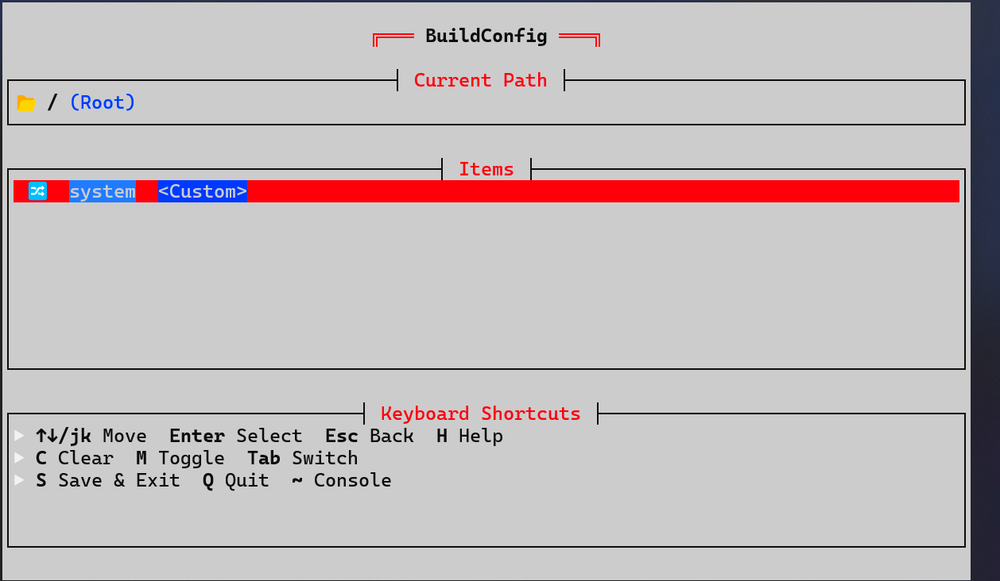

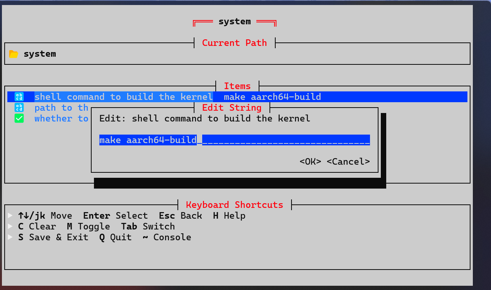

#### Step 3：设置编译输出地址

设置编译后 ELF 文件的输出路径（该文件即为需要加载进开发板的内核镜像）。

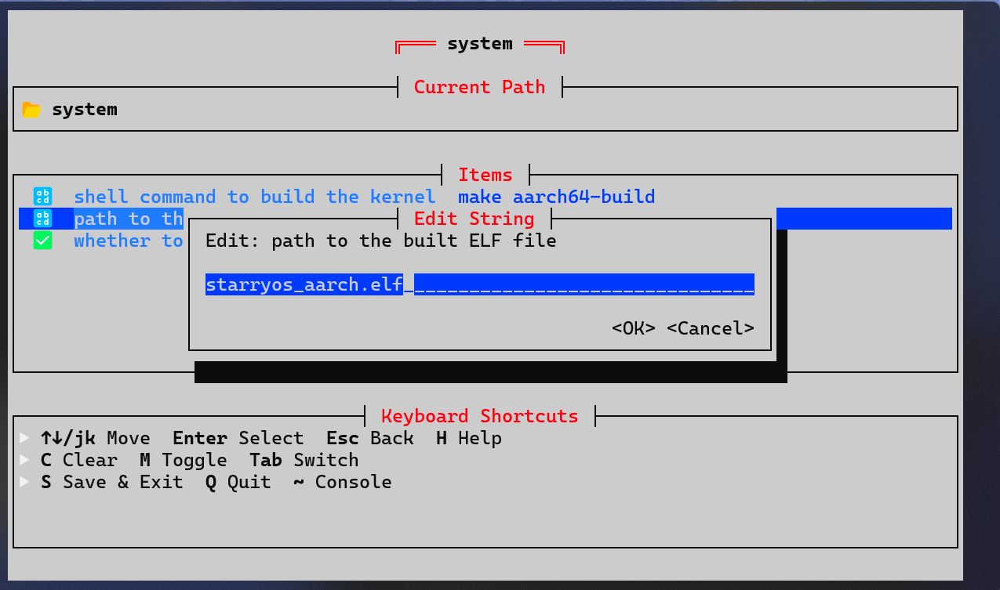

#### Step 4：保存配置

按 `s` 键保存配置。

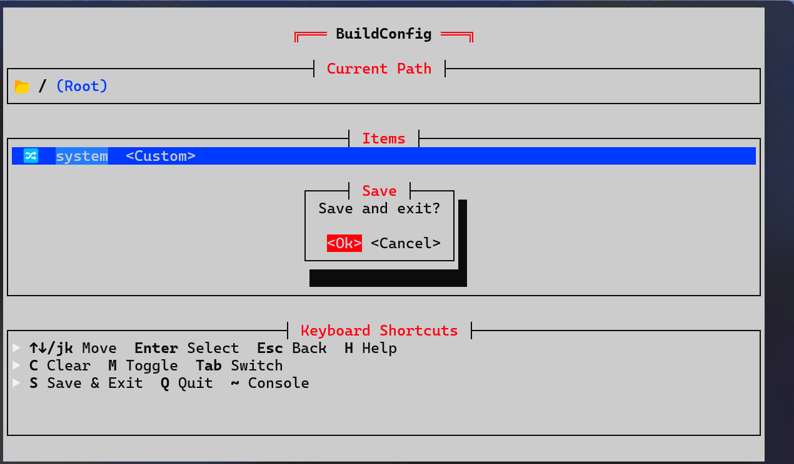

### 4. 配置 U-Boot 串口参数

运行以下命令进入 U-Boot 配置：

```bash
ostool menuconfig uboot
```

#### Step 5：设置波特率

将波特率设置为 **1500000**（基于 OrangePi 5 Plus 的默认配置）。

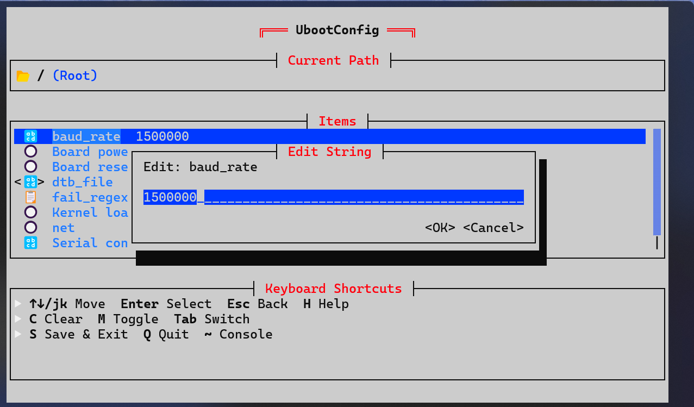

#### Step 6：设置设备树文件

选择对应的设备树文件（.dtb）。

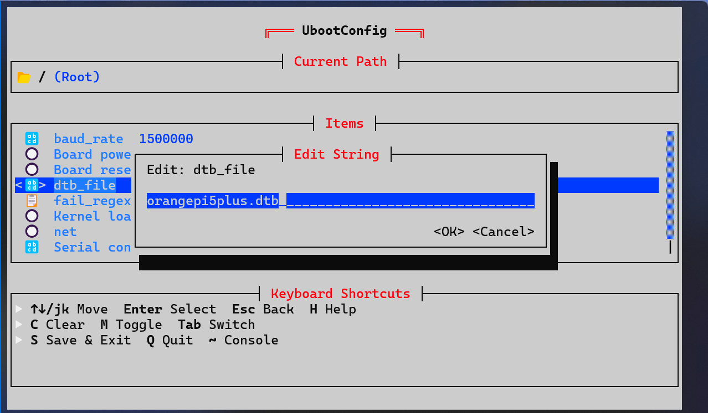

#### Step 7：设置串口设备

设置开发板对应的串口设备路径。

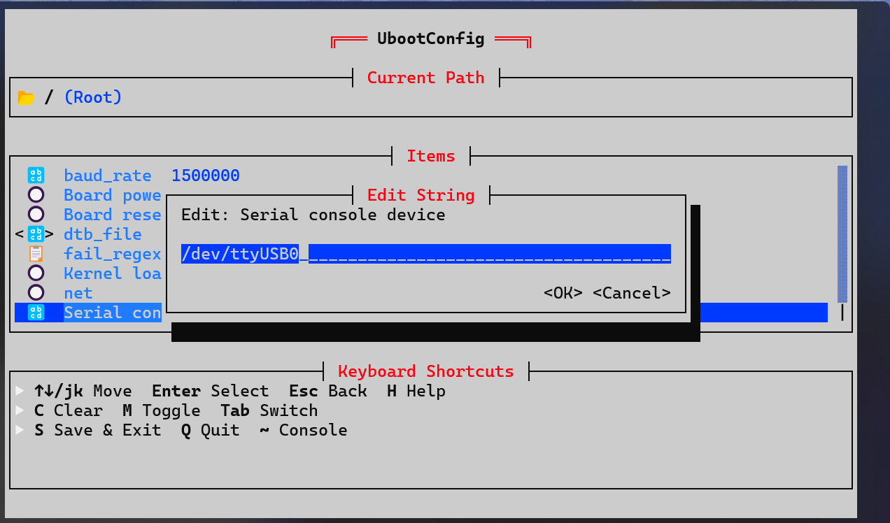

### 5. 烧录与启动

```bash
ostool run uboot
```

#### Step 8：开发板上电

执行命令后，给开发板**上电或开机**。ostool 会通过 U-Boot 的 `loady` 命令，经串口传输打包好的 FIT 镜像（内核 + 设备树文件）。

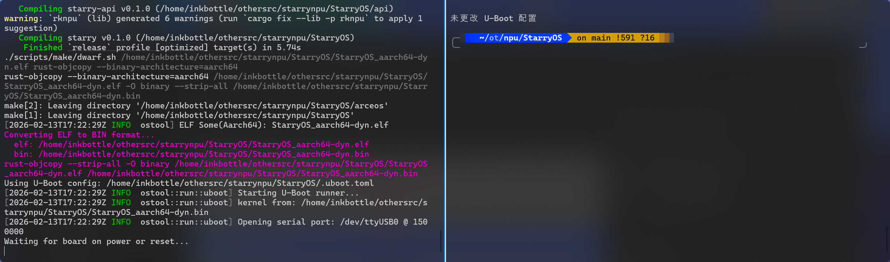

#### Step 9：等待传输完成

串口传输时间较长，请耐心等待。也可以通过 `ostool menuconfig` 配置 `net` 选项，使用网络方式快速传输。

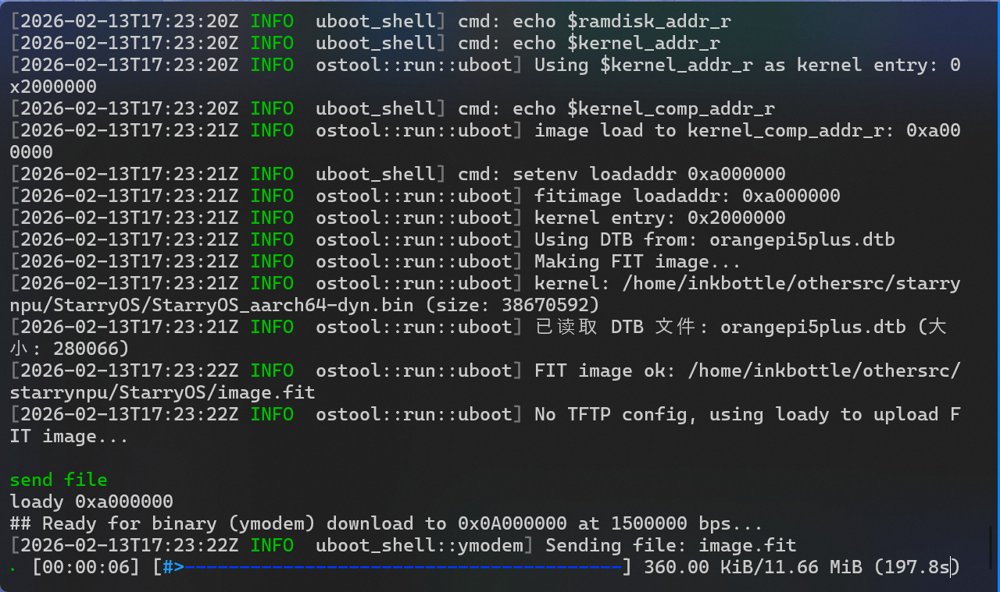

### 6. 运行 NPU 推理测试

#### Step 10：进入系统

传输完成后系统将自动启动。

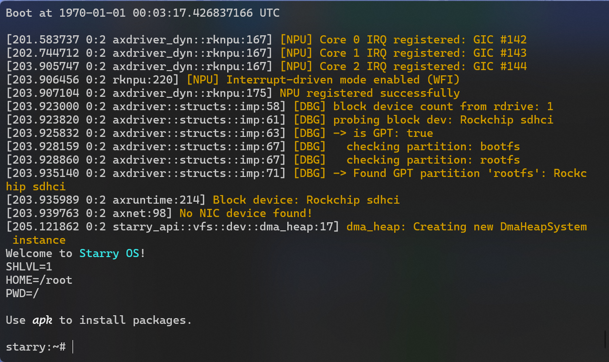

#### Step 11：运行测试

```bash
cd /demo
./llama.sh
```

运行 NPU 推理测试。`/demo` 目录下还包含其他测例（如 YOLO 目标检测等），可根据需要运行。

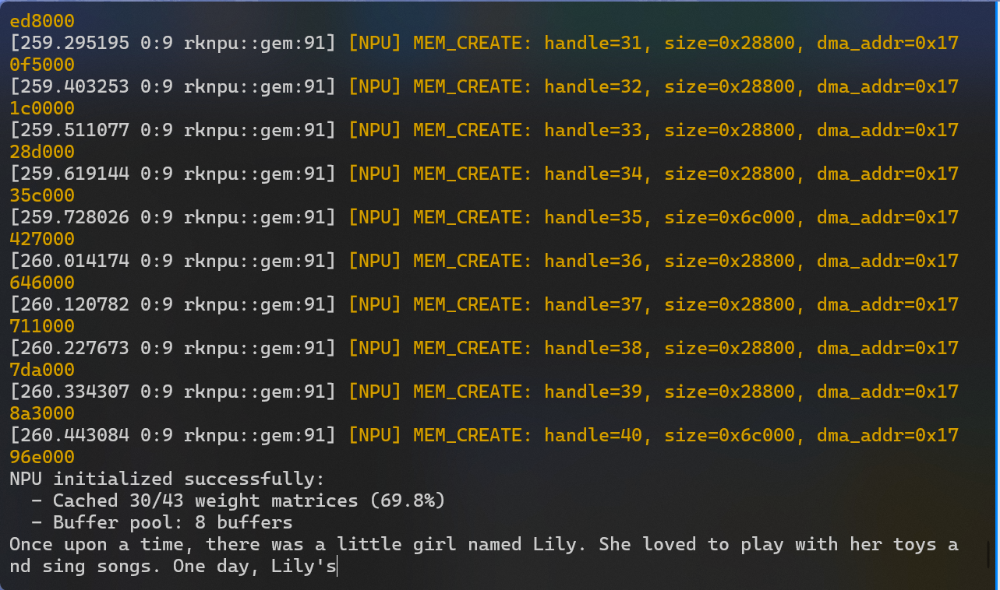

## 许可证

Apache-2.01