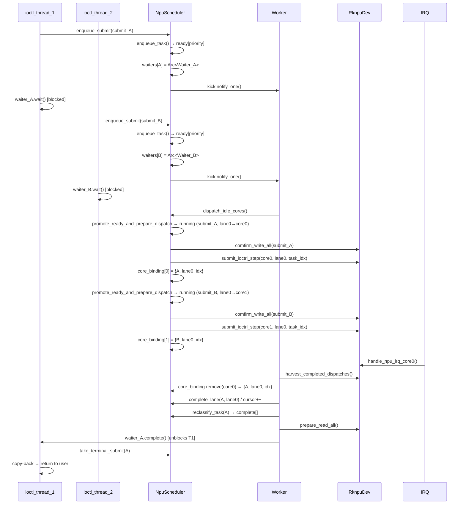
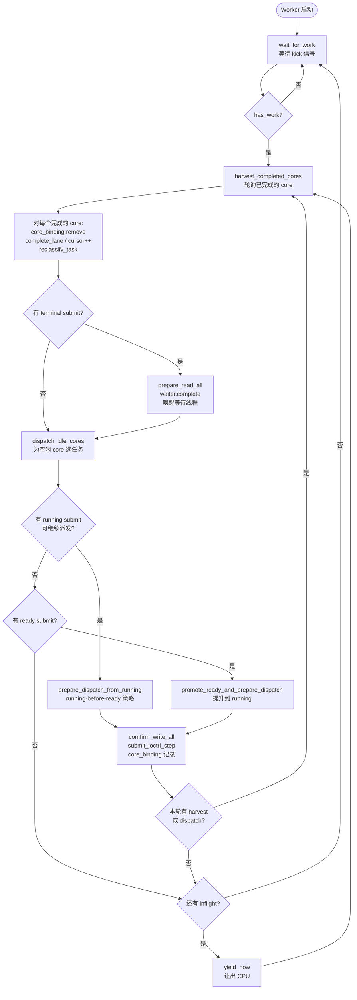

# RKNPU技术报告

本项目基于 StarryOS，面向 RK3588 平台上的 RKNPU 驱动研发。当前驱动已经具备寄存器访问、DMA/GEM 内存管理、任务描述符组织、ioctl 服务、任务提交、中断回收和多核调度链路。本轮二次开发的重点不是重新写一个驱动框架，而是在已有单核可运行基础上，把三核 NPU 真正用起来，并通过调度器让多个 submit 能按队列共享 NPU。最新 benchmark 显示，中大型任务场景下三核并行已经带来稳定正收益；但小任务和高同步开销场景仍然暴露出软件调度开销偏高的问题。

## 一、项目内容与用途

这个项目的对象是 RK3588 NPU 驱动及其在 StarryOS 上的系统集成。它的作用：让上层推理程序、benchmark 或后续 runtime 能稳定地把任务提交给 NPU 执行，而不是只能依赖 Linux 或闭源用户态库环境。

当前驱动已经覆盖了几条基础链路：

1. 寄存器/MMIO 访问：能够映射 RK3588 RKNPU 三个 core 的寄存器窗口，并通过寄存器接口完成 PC、CNA、DPU 等硬件模块的配置。
2. GEM/DMA 缓冲管理：支持用户态创建、映射、同步和销毁 NPU 可访问的 DMA buffer。
3. 任务描述符组织：支持 `RknpuTask`、regcmd、输入/权重/输出 buffer 的组合，并把这些描述符作为 submit 的基本执行单元。
4. ioctl 服务：支持 `Submit`、`MemCreate`、`MemMap`、`MemDestroy`、`MemSync`、`Action` 等 RKNPU 专用入口。
5. 中断与 completion 回收：IRQ handler 负责读取硬件完成状态，调度器再根据 core 绑定关系把 completion 还原到具体任务。
6. 多核调度：在一个 submit 中按 lane 把任务切到不同 core，同时支持多个 submit 进入队列等待。

这项工作的意义主要有两点。第一，它补齐了国产 SoC NPU 在自研 OS 下的驱动基础能力。第二，它给后续推理优化、runtime 接入、benchmark 对比和长时间稳定性测试提供了一个可控的实验平台。

## 二、本轮二次开发重点

### 2.1 支持 RK3588 三核 NPU 执行

RK3588 的 RKNPU 不是单个执行核心，而是三个可以并行工作的 NPU core。早期单核路径只证明了“任务能跑”，但没有把硬件并行能力发挥出来。本轮二次开发首先把提交路径改成能够识别 `core_mask` 和 `subcore_task`，让同一批任务可以被拆成多个 lane 分发到不同 core。

当前的三核执行模型可以概括为：

1. 用户态仍然通过一个 `RknpuSubmit` 提交任务批次。
2. `subcore_task[]` 描述每个 lane 的任务范围；如果用户态没有显式填写 lane，队列层会把任务归一化到默认 lane。
3. `core_mask` 决定这次 submit 允许使用哪些物理 core，例如 `0x1` 表示只用 core0，`0x7` 表示三个 core 都可用。
4. 调度器为每个空闲 core 挑选一个可派发 lane，然后调用底层 driver 对该 core 编程。
5. core 完成后，IRQ 路径发布 raw completion，调度器再回收并推进对应 lane 的 cursor。

这部分工作的重点不是简单把同一条命令发三遍，而是要保证每个 core 跑的是正确的 task slice，同一条 lane 不会被重复派发，completion 也能回到正确的 submit 和 task index。只有这些状态对齐，多核数据才有意义。

### 2.2 任务调度器与多线程共享 NPU

第二个重点是任务调度器。NPU 是共享硬件资源，不能让多个线程各自直接碰寄存器，否则很容易出现 core 状态、任务进度和 completion 归属混乱。当前实现保留外部的 blocking submit 语义，但内部引入了调度队列和 worker 线程：

1. 调用线程进入 `Submit` ioctl 后，不直接独占 NPU 跑完整批任务，而是把 submit 放进 scheduler。
2. 每个 submit 有自己的 waiter。调用线程只等待“自己的 submit 是否完成”。
3. 全局 worker 负责真正的 dispatch 和 harvest。它被 kick 唤醒后，先回收已完成 core，再给空闲 core 下发新任务。
4. scheduler 维护 ready、running、complete 这些状态。ready 表示还没开始跑的 submit，running 表示已有 lane 在跑或还有 lane 可继续派发，complete 表示终态结果等待 ioctl 路径取回。
5. 如果 running submit 还有可派发 lane，会优先继续推进 running，而不是马上切到一个全新的 ready submit。这样可以减少同一 submit 内部的等待空洞。

这里的重要配合点：底层等待函数 `wait_fn` 可以配置成 yield 型等待。这样 blocking submit 在等待硬件或等待调度推进时不会一直忙等占住 CPU，而是把执行权让给系统调度器。多个用户线程同时提交 NPU 任务时，线程可以各自阻塞在自己的 waiter 上，NPU 由全局 worker 串行管理硬件状态并并行利用多个 core。换句话说，NPU 对外看起来仍是阻塞式设备，对内已经具备“多线程共享、队列化提交、三核流式执行”的基础形态。

这版调度器的价值就在这里：它没有把用户态 ABI 改复杂，但把内核侧的执行模型从"谁提交谁跑"推进到了"统一排队、统一分发、统一回收"。

### 2.3 可观测性与卡顿排查

本轮开发过程中出现过 benchmark 运行卡住、需要手动退出的情况。这个问题不能靠猜：可能是硬件没有产生预期中断，也可能是 worker 没有继续 harvest，或者是任务状态已经 terminal 但 waiter 没被唤醒。因此这一轮也补了调度器日志，重点观察几个位置：

1. submit 是否成功入队。
2. worker 是否被 kick 唤醒。
3. 每个 core 是否成功 dispatch。
4. IRQ/completion 是否被 harvest。
5. terminal submit 是否进入 complete 并唤醒 waiter。

最新的 [log.txt](/home/inkbottle/othersrc/npu/log.txt) 这次没有复现卡死，最后输出了 `benchmark complete status=0`。这说明这一轮 benchmark 至少可以完整跑完；但它不能证明偶发卡顿已经彻底消失。后续仍然需要长时间循环、异常注入和更高日志粒度来区分硬件边界和软件边界。

### 2.4 引入 `rknpu-regs` 寄存器库

寄存器访问层也做了工程化整理，引入了基于 SVD / `svd2rust` 生成的 [drivers/rknpu-regs](/home/inkbottle/othersrc/npu/drivers/rknpu-regs)。驱动开发里手写寄存器偏移和位域非常容易出错，尤其是 NPU 这种寄存器块多、字段分散、不同 core 地址重复的硬件。

`rknpu-regs`：

1. 用类型化寄存器接口替代裸地址和 magic number。
2. 减少手工抄写偏移、位宽、mask 时的错误。
3. 让寄存器访问代码更接近硬件文档，后续查错更方便。
4. 把”访问寄存器”和”调度策略”拆开，避免调度器里混入大量底层地址细节。

这不是性能优化，但它直接影响驱动后续能不能继续维护。寄存器层越稳，上层调度和功能扩展越不容易被低级错误拖住。

## 三、benchmark 测试内容

### 3.1 测量范围与方法论

本次性能数据来自 [log.txt](/home/inkbottle/othersrc/npu/log.txt) 中运行的 `./core_scaling_benchmark`，对应测试程序是 [core_scaling_benchmark.c](/home/inkbottle/othersrc/npu/demo/npu_benchmark/tests/core_scaling_benchmark.c)。

**测量窗口**：仅覆盖 blocking `DRM_IOCTL_RKNPU_SUBMIT` 的完整往返时间，即 submit ioctl 从进入到返回。operand packing 和 regcmd generation 单独打印，不计入对比窗口。因此下面的数据反映的是 driver submit、scheduler dispatch/harvest、硬件执行和 completion 回收的综合耗时，而非单独的调度器开销或硬件计算时间。

**指标定义**：

- `speedup = T_1core / T_3core`（同一批任务 1-core 与 3-core 的平均 submit 时间之比）
- `parallel efficiency = speedup / 3`（理想三核加速为 3x，efficiency 衡量实际利用率）
- `GFLOP/s = 2 × GMAC/s`（1 MAC = 1 乘 + 1 加 = 2 FLOP）
- `jitter span = (T_max - T_min) / T_avg`（衡量单次 submit 时间的波动幅度）

**正确性校验**：第一轮 measured round 会对输出抽样与 CPU reference 比较，并检查每个 task 的 `int_status == 0x300`。这是抽样校验，不是全量验证。

### 3.2 测试环境

- **硬件平台**：RK3588 SoC（三核 NPU）
- **操作系统**：StarryOS
- **驱动版本**：commit 997b3a2（本报告对应版本）
- **Benchmark 程序**：`core_scaling_benchmark`（4 场景 × 2 operand 模式）
- **测量轮次**：每场景 warmup 2 轮 + measured 5-12 轮（场景相关）
- **频率/电源控制**：未控制（默认 governor）
- **热稳态控制**：未控制
- **IRQ 亲和性**：未设置

### 3.3 测试场景

每个场景一般又分两种 operand 模式：

1. `shared-operands`：所有任务复用同一份 input/weight，只有 output slice 私有。这更偏向测试调度和计算本身，DMA footprint 较小。
2. `unique-operands`：每个 task 有自己的 input/weight/output slice。这更接近多任务独立数据的情况，内存占用和准备成本更高。

测试程序里固定了四个场景。它们不是随便取的矩阵形状，而是分别压不同瓶颈：

| 场景 | 矩阵形状 | shared tasks | unique tasks | warmup | measured | 主要验证点 |
| --- | --- | ---: | ---: | ---: | ---: | --- |
| `tiny_dispatch` | `M=4 K=32 N=16` | 96 | 96 | 2 | 12 | 小矩阵，submit/scheduler 固定开销占比最高，用来观察多核调度在短任务下是否会被开销吞掉。 |
| `mid_balanced` | `M=64 K=512 N=512` | 48 | 12 | 2 | 8 | 中等矩阵，调度开销和计算吞吐都会影响结果，用来判断调度器是否进入稳定可用区间。 |
| `throughput_heavy` | `M=128 K=1024 N=1024` | 24 | 4 | 2 | 5 | 大矩阵，目标是把瓶颈推向 NPU 计算吞吐；unique 任务数较少，是为了控制 DMA footprint。 |
| `llama_decode_like` | `M=1 K=4096 N=4096` | 48 | 0 | 2 | 8 | 低 M、高 K、高 N，接近 LLM decode 阶段线性层投影形状，更关注长任务延迟和尾部波动。 |

`tiny_dispatch` 主要看调度器的“底噪”。如果这个场景三核退化，说明每次 dispatch、IRQ 回收、worker yield、waiter 唤醒的成本已经压过了硬件并行收益。它使用 96 个 task，任务数足够多，可以持续给三个 core 喂任务，但单 task 计算量非常小。

`mid_balanced` 是更接近日常 benchmark 的中间档。shared 模式有 48 个 task，unique 模式只有 12 个 task，因为 unique 模式每个 task 都有独立 input/weight/output，内存占用增长更快。这个场景用来观察调度器在“既有计算量、又有一定任务数量”的情况下是否稳定。

`throughput_heavy` 则故意把矩阵放大。shared 模式有 24 个 task，unique 模式只有 4 个 task。这里不是为了追求任务数，而是为了让每个 task 本身足够重，看三核并行能否把 GFLOP/s 拉上去。unique 任务数少也会暴露另一个问题：当任务批次太短时，三核并行窗口会变窄。

`llama_decode_like` 只跑 shared 模式，unique tasks 在测试程序里设为 0，所以日志里会跳过 unique。它模拟的是 decode 阶段常见的投影类 workload：M 很低，但 K 和 N 很大。这个场景不一定追求最高吞吐，更关心一次 submit 的阻塞时间能不能被多核明显压下来。

测试程序还有几个细节值得说明。输入和权重不是随机数，而是由 `deterministic_input_value()` 和 `deterministic_weight_value()` 生成的整数模式；输出会抽样和 CPU reference 比较。每个 task 的 `int_status` 也会检查，期望值是 `0x300`。任务分发时，`distribute_tasks_to_cores()` 会按 core 数把 task range 平均切到 `subcore_task[]`，1 core 时只填 core0，3 cores 时填 core0/core1/core2 并设置对应 `core_mask`。因此这个 benchmark 测到的不是单纯的 C 程序循环，而是完整覆盖了 submit ABI、调度器 lane 切分、三核 dispatch、IRQ completion 和 copy-back 这些路径。

## 四、benchmark 结果与性能分析

### 4.1 总体结论

这次 benchmark 的结果比上一版更明确：所有有效场景里，三核都比单核快，没有出现最终退化。最好的场景是 `llama_decode_like/shared-operands`，从 `344.354 ms` 降到 `137.000 ms`，speedup 达到 `2.514x`，parallel efficiency 为 `83.78%`。这说明调度器已经能把 RK3588 三个 NPU core 的并行能力用起来。

但也不能把结果说满。即便三核都有正收益，大多数场景的 parallel efficiency 仍在 `57%` 到 `68%` 左右，离理想 `3x` 还有距离。原因很现实：每个 task 的硬件执行并不是唯一成本，driver 编程、IRQ 回收、worker 调度、cache/DMA 同步、submit 阻塞唤醒都会吃掉一部分收益。任务越小，这部分固定成本越明显。

### 4.2 结果汇总

| 场景 | 模式 | 任务数 | 1-core avg submit | 3-core avg submit | speedup | parallel efficiency |
| --- | --- | ---: | ---: | ---: | ---: | ---: |
| `tiny_dispatch` | shared | 96 | `2.533 ms` | `1.423 ms` | `1.780x` | `59.32%` |
| `tiny_dispatch` | unique | 96 | `3.478 ms` | `1.739 ms` | `2.000x` | `66.67%` |
| `mid_balanced` | shared | 48 | `32.496 ms` | `18.746 ms` | `1.733x` | `57.78%` |
| `mid_balanced` | unique | 12 | `10.459 ms` | `6.065 ms` | `1.724x` | `57.48%` |
| `throughput_heavy` | shared | 24 | `42.656 ms` | `20.864 ms` | `2.044x` | `68.15%` |
| `throughput_heavy` | unique | 4 | `6.781 ms` | `3.939 ms` | `1.721x` | `57.38%` |
| `llama_decode_like` | shared | 48 | `344.354 ms` | `137.000 ms` | `2.514x` | `83.78%` |

### 4.3 `tiny_dispatch`：小任务也有明显收益

`tiny_dispatch` 的矩阵规模很小，单 task 的计算量低。当前结果里，shared 模式从 `2.533 ms` 降到 `1.423 ms`，unique 模式从 `3.478 ms` 降到 `1.739 ms`。这说明当前调度器的固定开销没有大到完全吞掉三核收益，小任务也能加速。

但是这个场景的性能不能过度解读。shared 模式 parallel efficiency 是 `59.32%`，unique 模式是 `66.67%`，距离理想三核加速2x以上仍有明显差距。小任务下，每次 dispatch 和 completion 的成本占比很高，真正花在矩阵计算上的时间太短。后续如果要优化小任务，需要减少每 task 的下发/回收成本，或者把更多小 task 合并成更粗粒度的 batch。

### 4.4 `mid_balanced`：中等任务证明调度器进入显著加速区间

`mid_balanced` 是这次比较有代表性的场景。shared 模式中，1 core 平均 submit 为 `32.496 ms`，3 core 为 `18.746 ms`，speedup 为 `1.733x`。unique 模式中，1 core 为 `10.459 ms`，3 core 为 `6.065 ms`，speedup 为 `1.724x`。

这个结果说明，调度器在中等任务规模下已经进入稳定可用区间。两种 operand 模式都接近 `1.7x`，没有只在某一种特殊数据复用方式下才有效。它也说明当前瓶颈不只是数据准备，因为 benchmark 的 measured window 没把 operand packing 算进去；submit 阶段本身确实因为多核并行缩短了。

### 4.5 `throughput_heavy`：吞吐型任务收益更明显

`throughput_heavy` 的 shared 模式从 `42.656 ms` 降到 `20.864 ms`，speedup 达到 `2.044x`，parallel efficiency 为 `68.15%`。同时 GFLOP/s 从 `151.033` 提升到 `308.786`，基本也是 `2.044x` 的增益。这个场景最能说明三核调度的直接价值：任务足够重之后，固定调度开销被摊薄，硬件并行执行开始成为主导因素。

unique 模式任务数只有 4 个，这是为了控制 DMA footprint。它仍然从 `6.781 ms` 降到 `3.939 ms`，speedup 为 `1.721x`。任务数少会限制三核利用率，因为 worker 能同时派发的 lane 数量和后续补发机会都变少。这个结果没有 shared 模式好，但仍然是稳定正收益。

### 4.6 `llama_decode_like`：长任务场景收益最好，但 jitter 需要注意

`llama_decode_like` 是本次最强的结果。它的 shared 模式从 `344.354 ms` 降到 `137.000 ms`，speedup 达到 `2.514x`，parallel efficiency 为 `83.78%`，GFLOP/s 从 `4.677` 提升到 `11.756`。这说明在低 M、高 K、高 N 的投影类 workload 下，当前三核调度能显著降低 submit 阻塞时间。

但这个场景也暴露了一个细节：3-core 的 min/max 为 `126.027 / 139.504 ms`，jitter span 达到 `9.84%`，明显高于 1-core 的 `0.03%`。也就是说，平均值很好，但三核路径下仍有一定波动。可能原因包括 worker harvest 时机、core completion 到达顺序、yield 后重新调度的时间差，以及更长任务下不同 core 之间的尾部等待。这个问题不会否定三核收益，但后续需要继续看尾延迟，不能只看平均值。

### 4.7 这轮结果说明了什么

这次数据可以支持三个判断：

1. 三核支持已经有效。所有有效 benchmark 场景都显示 3-core submit 时间低于 1-core。
2. 调度器设计已在真实 benchmark 中转化为性能收益。ready/running 队列推进、core binding 和 completion 回收这套机制能够有效利用三核并行。需要注意的是，当前 benchmark 验证的是单次 blocking submit 内的多核扩展收益，而非多线程并发提交的竞争场景——后者是调度器设计支持的能力，但尚未专项测试。
3. 软件开销仍然存在。大多数场景没有接近理想 `3x`，说明 dispatch、harvest、同步和调度唤醒成本仍然需要优化。

还有一点要单独说：这次日志完整跑到 `benchmark complete status=0`，说明当前版本在这组测试里没有卡死。但之前出现过"最后真卡住"的情况，所以稳定性结论不能只靠一次成功日志。更合理的说法是：当前性能趋势已经明确，偶发卡顿还需要通过长时间循环和更细日志继续定位。

### 4.8 测量有效性说明（Threats to Validity）

以下因素限制了本次 benchmark 结论的适用范围：

1. **测量窗口仅覆盖 submit 往返时间**。数据反映的是 driver submit + scheduler dispatch/harvest + 硬件执行 + completion 回收的综合耗时，不能单独归因于调度器优化或硬件计算。
2. **正确性校验为抽样**。每场景仅第一轮 measured round 做输出抽样比对，不是全量验证。
3. **未进行多线程并发提交测试**。当前 benchmark 是单线程顺序提交，每次 submit 等待完成后再提交下一个。调度器设计支持多线程共享 NPU，但该能力尚未通过专项并发测试验证。
4. **测试环境控制不足**。频率、电压、温度、IRQ 亲和性均未固定，结果可能受系统状态影响。
5. **样本轮数有限**。measured rounds 为 5-12 轮，统计置信度有限，尤其对尾延迟分析不够充分。
6. **三核路径 jitter 明显高于单核**。`llama_decode_like` 3-core jitter span 达 `9.84%`，而 1-core 仅 `0.03%`，说明三核路径存在不确定性来源，平均值不能完整代表实际表现。

## 五、功能模块分层与实现思想

当前实现可以按从上到下的链路理解。

最上层是用户态 benchmark 或 runtime。它负责准备输入、权重、输出、regcmd 和 task array，然后通过 ioctl 提交任务。benchmark 还负责构造不同矩阵规模和不同 operand 共享模式，用来观察调度器在不同负载下的行为。

再往下是 ioctl / service 边界层。它负责把用户态传进来的 `RknpuSubmit`、`RknpuTask[]` 和内存管理请求拷入内核，转换成驱动内部可以处理的数据。这里不应该保存太多调度状态，否则 ioctl 层会变成第二个 scheduler。

scheduler 层负责 submit 生命周期。它维护 ready、running、complete 三个 bucket，管理每个 submit 的 waiter，也负责唤醒全局 worker。waiter 和 kick 的职责要分清：waiter 是 per-submit 的，回答"这个 submit 完成了吗"；kick 是全局 worker 信号，回答"现在有没有新活需要 worker 醒来处理"。这两个东西混在一起，调度器会很难读，也很容易漏唤醒。

driver / dispatch / IRQ 层负责硬件事实。driver 给某个 core 编程，IRQ handler 读取和清除硬件中断，completion 只表示"某个 core 有原始完成状态"。至于这个 completion 属于哪个 submit、哪个 lane、哪个 task index，应由 scheduler 根据 core_binding 还原，而不是让 driver 反向保存一堆队列语义。

最底层是寄存器访问层，也就是 `rknpu-regs`。它提供类型化 register API。调度器不应该知道太多寄存器细节，寄存器层也不应该知道队列策略。这个分层让后续工作可以分开推进：寄存器访问继续补全，调度策略继续优化，ioctl ABI 保持稳定。

## 六、当前限制与问题分析

1. 三核收益仍然低于理想值。除了 `llama_decode_like` 达到 `83.78%` efficiency，多数场景仍在 `57%` 到 `68%` 左右。说明当前并行并不是完全线性扩展，软件路径还有明显成本。
2. 小任务场景仍然敏感。`tiny_dispatch` 虽然这次有正收益，但它的绝对 submit 时间只有毫秒级，任何一次额外调度、yield、IRQ 回收或锁竞争都会改变结果。后续如果要跑大量小算子，必须继续压低固定开销。
3. 3-core 路径存在尾延迟波动。`llama_decode_like` 的平均 speedup 很好，但 3-core jitter span 到了 `9.84%`。这提示我们不能只盯 avg submit，还要看 min/max 和尾延迟。
4. blocking submit 语义简单，但表达能力有限。它适合当前兼容和调试，也方便用户态直接使用；但如果后续要做更复杂的异步 runtime、跨模型调度或 submit overlap，现有接口还需要继续扩展。
5. 单 worker 模型让状态清楚，但可能成为瓶颈。当前它的好处是所有 dispatch/harvest 串在一个地方，不容易乱；坏处是复杂混合负载下 worker 本身可能限制吞吐。
6. 偶发卡顿还没有完全定性。这次 `log.txt` 正常结束，不能直接推翻之前的卡住现象。后续需要专门的长跑日志，记录 worker 是否还活着、core binding 是否残留、IRQ status 是否发布、waiter 是否被唤醒。
7. 平台能力还没有完全接入 action 路径。clock、regulator、PM 的底层集成都有基础，但 `RknpuAction::PowerOn/PowerOff`、频率和电压类 action 还需要通过 service/platform trait 正式收口。

## 七、调度器的执行时序

本节描述调度器的内部机制和执行流程，内容基于 `drivers/rknpu/src/service/scheduler.rs` 和 `drivers/rknpu/src/task/taskqueen.rs` 的实现。

### 7.1 核心数据结构

**`NpuSchedulerState`**（调度器全局状态，受单一 mutex 保护）：
- `tasks: BTreeMap<RknpuQueueTaskId, RknpuQueueTask>` — 所有活跃 submit 的唯一所有者
- `ready: BTreeMap<i32, VecDeque<RknpuQueueTaskId>>` — 按优先级分桶，尚未开始执行的 submit
- `running: BTreeMap<i32, VecDeque<RknpuQueueTaskId>>` — 按优先级分桶，已有 lane 在执行或还有 lane 可派发的 submit
- `complete: BTreeMap<RknpuQueueTaskId, RknpuQueueTask>` — 已终态，等待 ioctl 路径取回
- `core_binding: BTreeMap<usize, CoreRunBinding>` — 物理 core → `{task_id, lane_slot, task_index}` 的归属映射
- `waiters: BTreeMap<RknpuQueueTaskId, Arc<W>>` — per-submit 的阻塞等待器

**`RknpuQueueTask`**（单个 submit 的运行时状态）：
- `lane_isrun: [bool; 5]` — 每条 lane 是否有任务在飞
- `subcore_cursors: [u32; 5]` — 每条 lane 已完成的 task 数量
- `last_error: Option<RknpuError>` — 错误状态

submit 的生命周期状态（ready/running/complete）不是单独维护的枚举，而是由 `lane_isrun`、`subcore_cursors`、`last_error` 的组合派生，并通过 `reclassify_task()` 决定 submit 应归入哪个 bucket。

### 7.2 调度策略

**running-before-ready**：`dispatch_idle_cores()` 为每个空闲 core 选择候选时，优先从 `running` bucket 中找可继续派发的 submit（`prepare_dispatch_from_running`），只有当没有 running submit 可用时，才从 `ready` 提升新 submit（`promote_ready_and_prepare_dispatch`）。这减少了同一 submit 内部的等待空洞，但对等待中的 ready submit 不是严格公平的。

**内存同步边界**：
- `comfirm_write_all()`：在一次 `dispatch_idle_cores()` 调用中，对某个 submit 首次派发前调用，确保 DMA 写入对硬件可见
- `prepare_read_all()`：在 terminal submit 唤醒 waiter 前调用，确保硬件写回对 CPU 可见

### 7.3 图一：Submit 生命周期

下图展示单个 submit 从 ioctl 入队到 copy-back 返回的完整路径，以及多个并发 submit 线程如何通过独立 waiter 共享同一个 worker。

### 7.4 图二：Worker 主循环与多核派发

下图展示 worker 线程的主循环结构，以及 harvest 和 dispatch 如何交替推进多个 submit 的执行。

## 八、总结与后续工作

本轮二次开发把 RKNPU 驱动从"单核能跑"推进到了"三核能跑、能调度、能测出收益"的阶段。3-core 支持已经在 benchmark 中体现出实际价值，任务调度器也证明了 blocking submit 之下可以做统一队列管理。现在最重要的问题不再是"方向对不对"，而是继续把这条路径压稳、压快。

后续工作建议集中在四个方向：

1. 继续压缩 dispatch、harvest、同步和 worker 唤醒成本，尤其关注小任务和短 submit。
2. 增加长时间循环 benchmark 和卡顿复现测试，重点记录 worker、core binding、IRQ status 和 waiter 状态。
3. 把 clock、regulator、PM 能力通过 service/platform trait 接入 action 路径，让电源和频率管理进入正式接口。
4. 继续整理 driver/service/scheduler 分层，避免调度状态重新散落到 ioctl 和低层 driver 里。
