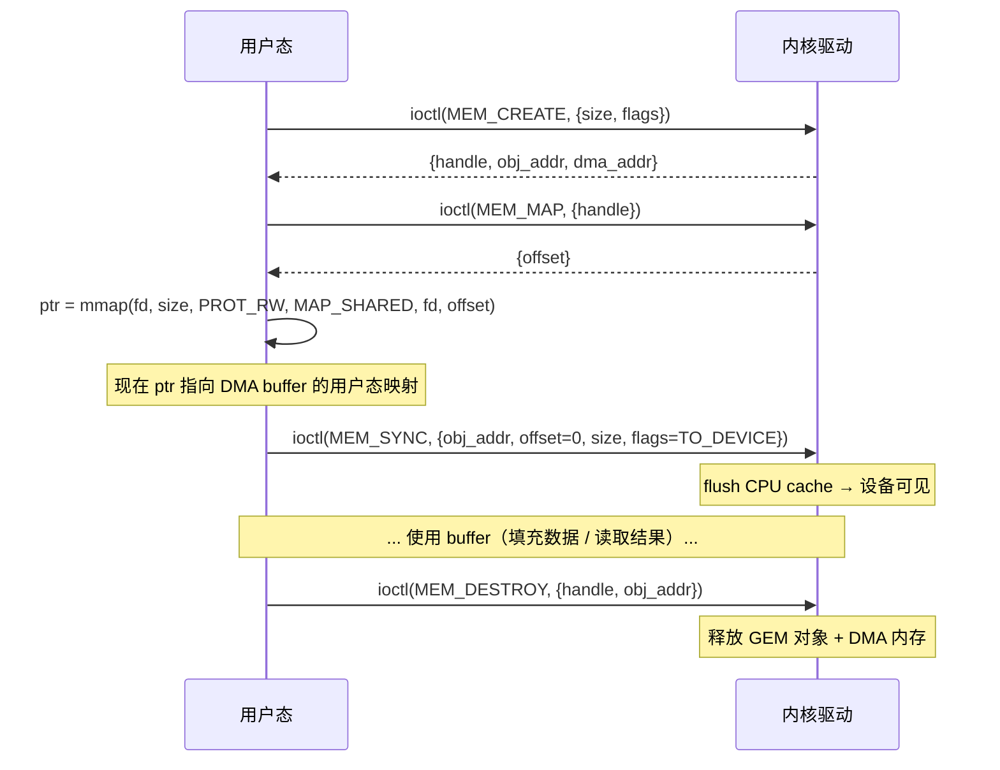

# IOCTL 协议与数据结构

本章整理 RKNPU 驱动的全部 ioctl 命令、传参结构体布局、flags 枚举，以及 `mmap(offset)` 编码规则。

---

## 1. IOCTL 命令表

RKNPU 驱动提供 **6 个 ioctl 命令**，同时定义了两套编号：

<table>
<tr>
<th>命令</th><th>编号</th><th>DRM 路径宏</th><th>非 DRM 路径宏</th><th>方向</th><th>结构体</th><th>功能</th>
</tr>
<tr>
<td><strong>ACTION</strong></td><td><code>0x00</code></td>
<td><code>DRM_IOCTL_RKNPU_ACTION</code></td>
<td><code>IOCTL_RKNPU_ACTION</code></td>
<td>IOWR</td>
<td><code>rknpu_action</code></td>
<td>查询/设置：版本、频率、电压、电源、统计、复位等</td>
</tr>
<tr>
<td><strong>SUBMIT</strong></td><td><code>0x01</code></td>
<td><code>DRM_IOCTL_RKNPU_SUBMIT</code></td>
<td><code>IOCTL_RKNPU_SUBMIT</code></td>
<td>IOWR</td>
<td><code>rknpu_submit</code></td>
<td>提交 NPU 任务（PC job）</td>
</tr>
<tr>
<td><strong>MEM_CREATE</strong></td><td><code>0x02</code></td>
<td><code>DRM_IOCTL_RKNPU_MEM_CREATE</code></td>
<td><code>IOCTL_RKNPU_MEM_CREATE</code></td>
<td>IOWR</td>
<td><code>rknpu_mem_create</code></td>
<td>分配 DMA buffer（GEM 对象）</td>
</tr>
<tr>
<td><strong>MEM_MAP</strong></td><td><code>0x03</code></td>
<td><code>DRM_IOCTL_RKNPU_MEM_MAP</code></td>
<td><code>IOCTL_RKNPU_MEM_MAP</code></td>
<td>IOWR</td>
<td><code>rknpu_mem_map</code></td>
<td>获取 mmap 用的 fake offset</td>
</tr>
<tr>
<td><strong>MEM_DESTROY</strong></td><td><code>0x04</code></td>
<td><code>DRM_IOCTL_RKNPU_MEM_DESTROY</code></td>
<td><code>IOCTL_RKNPU_MEM_DESTROY</code></td>
<td>IOWR</td>
<td><code>rknpu_mem_destroy</code></td>
<td>释放 DMA buffer</td>
</tr>
<tr>
<td><strong>MEM_SYNC</strong></td><td><code>0x05</code></td>
<td><code>DRM_IOCTL_RKNPU_MEM_SYNC</code></td>
<td><code>IOCTL_RKNPU_MEM_SYNC</code></td>
<td>IOWR</td>
<td><code>rknpu_mem_sync</code></td>
<td>Cache 同步（flush / invalidate）</td>
</tr>
</table>

### 1.1 两套编号的区别

<table>
<tr><th></th><th>DRM 路径</th><th>非 DRM 路径</th></tr>
<tr>
<td><strong>编码方式</strong></td>
<td><code>DRM_IOWR(DRM_COMMAND_BASE + nr, type)</code></td>
<td><code>_IOWR('r', nr, type)</code></td>
</tr>
<tr>
<td><strong>设备节点</strong></td>
<td><code>/dev/dri/cardX</code></td>
<td><code>/dev/rknpu</code>（如果驱动注册了）</td>
</tr>
<tr>
<td><strong>调用方式</strong></td>
<td><code>drmIoctl(fd, DRM_IOCTL_RKNPU_*, &arg)</code></td>
<td><code>ioctl(fd, IOCTL_RKNPU_*, &arg)</code></td>
</tr>
<tr>
<td><strong>闭源库使用</strong></td>
<td> <code>librknnrt.so</code> 主要走此路径</td>
<td>备选</td>
</tr>
</table>

> rknpu-ioctl.h 中 `RKNPU_IOC_MAGIC = 'r'`，`DRM_COMMAND_BASE` 来自 `<libdrm/drm.h>`（通常为 `0x40`）。

---

## 2. 结构体布局

### 2.1 `struct rknpu_action`（8 字节）

用于 `ACTION` ioctl，查询/设置各种属性。

<table>
<tr><th>偏移</th><th>大小</th><th>类型</th><th>字段</th><th>说明</th></tr>
<tr><td><code>0x00</code></td><td>4</td><td><code>__u32</code></td><td><code>flags</code></td><td>Action 编号（见 §3.4）</td></tr>
<tr><td><code>0x04</code></td><td>4</td><td><code>__u32</code></td><td><code>value</code></td><td>GET 时为返回值，SET 时为输入值</td></tr>
</table>

### 2.2 `struct rknpu_mem_create`（40 字节）

<table>
<tr><th>偏移</th><th>大小</th><th>类型</th><th>字段</th><th>方向</th><th>说明</th></tr>
<tr><td><code>0x00</code></td><td>4</td><td><code>__u32</code></td><td><code>handle</code></td><td>OUT</td><td>GEM 对象句柄（驱动分配）</td></tr>
<tr><td><code>0x04</code></td><td>4</td><td><code>__u32</code></td><td><code>flags</code></td><td>IN</td><td>内存类型 flags（见 §3.1）</td></tr>
<tr><td><code>0x08</code></td><td>8</td><td><code>__u64</code></td><td><code>size</code></td><td>IN</td><td>申请大小（内部页对齐）</td></tr>
<tr><td><code>0x10</code></td><td>8</td><td><code>__u64</code></td><td><code>obj_addr</code></td><td>OUT</td><td>内核对象地址（opaque token）</td></tr>
<tr><td><code>0x18</code></td><td>8</td><td><code>__u64</code></td><td><code>dma_addr</code></td><td>OUT</td><td>设备侧 DMA 地址（IOVA 或物理地址）</td></tr>
<tr><td><code>0x20</code></td><td>8</td><td><code>__u64</code></td><td><code>sram_size</code></td><td>IN</td><td>可选 SRAM 申请大小</td></tr>
</table>

> StarryOS Rust 驱动 扩展了额外字段：`iommu_domain_id: i32`、`core_mask: u32`，用于多核/IOMMU 域管理。

### 2.3 `struct rknpu_mem_map`（16 字节）

<table>
<tr><th>偏移</th><th>大小</th><th>类型</th><th>字段</th><th>方向</th><th>说明</th></tr>
<tr><td><code>0x00</code></td><td>4</td><td><code>__u32</code></td><td><code>handle</code></td><td>IN</td><td>GEM 句柄</td></tr>
<tr><td><code>0x04</code></td><td>4</td><td><code>__u32</code></td><td><code>reserved</code></td><td>—</td><td>64 位对齐填充</td></tr>
<tr><td><code>0x08</code></td><td>8</td><td><code>__u64</code></td><td><code>offset</code></td><td>OUT</td><td>fake offset，用于 <code>mmap(fd, ..., offset)</code></td></tr>
</table>

### 2.4 `struct rknpu_mem_destroy`（16 字节）

<table>
<tr><th>偏移</th><th>大小</th><th>类型</th><th>字段</th><th>方向</th><th>说明</th></tr>
<tr><td><code>0x00</code></td><td>4</td><td><code>__u32</code></td><td><code>handle</code></td><td>IN</td><td>GEM 句柄</td></tr>
<tr><td><code>0x04</code></td><td>4</td><td><code>__u32</code></td><td><code>reserved</code></td><td>—</td><td>填充</td></tr>
<tr><td><code>0x08</code></td><td>8</td><td><code>__u64</code></td><td><code>obj_addr</code></td><td>IN</td><td>内核对象地址</td></tr>
</table>

### 2.5 `struct rknpu_mem_sync`（32 字节）

<table>
<tr><th>偏移</th><th>大小</th><th>类型</th><th>字段</th><th>方向</th><th>说明</th></tr>
<tr><td><code>0x00</code></td><td>4</td><td><code>__u32</code></td><td><code>flags</code></td><td>IN</td><td>同步方向（见 §3.2）</td></tr>
<tr><td><code>0x04</code></td><td>4</td><td><code>__u32</code></td><td><code>reserved</code></td><td>—</td><td>填充</td></tr>
<tr><td><code>0x08</code></td><td>8</td><td><code>__u64</code></td><td><code>obj_addr</code></td><td>IN</td><td>要同步的内核对象地址</td></tr>
<tr><td><code>0x10</code></td><td>8</td><td><code>__u64</code></td><td><code>offset</code></td><td>IN</td><td>同步起始偏移（字节）</td></tr>
<tr><td><code>0x18</code></td><td>8</td><td><code>__u64</code></td><td><code>size</code></td><td>IN</td><td>同步区域大小</td></tr>
</table>

### 2.6 `struct rknpu_task`（36 字节，`__packed`）

单个任务描述，由 PC 命令流引擎解释执行。

<table>
<tr><th>偏移</th><th>大小</th><th>类型</th><th>字段</th><th>说明</th></tr>
<tr><td><code>0x00</code></td><td>4</td><td><code>__u32</code></td><td><code>flags</code></td><td>任务标志</td></tr>
<tr><td><code>0x04</code></td><td>4</td><td><code>__u32</code></td><td><code>op_idx</code></td><td>算子索引</td></tr>
<tr><td><code>0x08</code></td><td>4</td><td><code>__u32</code></td><td><code>enable_mask</code></td><td>模块使能掩码</td></tr>
<tr><td><code>0x0C</code></td><td>4</td><td><code>__u32</code></td><td><code>int_mask</code></td><td>期望的完成中断掩码</td></tr>
<tr><td><code>0x10</code></td><td>4</td><td><code>__u32</code></td><td><code>int_clear</code></td><td>中断清除值</td></tr>
<tr><td><code>0x14</code></td><td>4</td><td><code>__u32</code></td><td><code>int_status</code></td><td>完成后驱动写回实际中断状态</td></tr>
<tr><td><code>0x18</code></td><td>4</td><td><code>__u32</code></td><td><code>regcfg_amount</code></td><td>寄存器配置项数量</td></tr>
<tr><td><code>0x1C</code></td><td>4</td><td><code>__u32</code></td><td><code>regcfg_offset</code></td><td>寄存器配置在命令流中的偏移</td></tr>
<tr><td><code>0x20</code></td><td>8</td><td><code>__u64</code></td><td><code>regcmd_addr</code></td><td>寄存器命令流 DMA 地址</td></tr>
</table>

> **`__packed`**：编译器不插入 padding，保证与内核侧布局一致。

### 2.7 `struct rknpu_subcore_task`（8 字节）

<table>
<tr><th>偏移</th><th>大小</th><th>类型</th><th>字段</th><th>说明</th></tr>
<tr><td><code>0x00</code></td><td>4</td><td><code>__u32</code></td><td><code>task_start</code></td><td>该子核心的起始 task 索引</td></tr>
<tr><td><code>0x04</code></td><td>4</td><td><code>__u32</code></td><td><code>task_number</code></td><td>该子核心要执行的 task 数量</td></tr>
</table>

### 2.8 `struct rknpu_submit`（96 字节）

任务提交主结构体，驱动最核心的入口。

<table>
<tr><th>偏移</th><th>大小</th><th>类型</th><th>字段</th><th>说明</th></tr>
<tr><td><code>0x00</code></td><td>4</td><td><code>__u32</code></td><td><code>flags</code></td><td>Job 模式（见 §3.3）</td></tr>
<tr><td><code>0x04</code></td><td>4</td><td><code>__u32</code></td><td><code>timeout</code></td><td>超时时间（ms）</td></tr>
<tr><td><code>0x08</code></td><td>4</td><td><code>__u32</code></td><td><code>task_start</code></td><td>全局起始 task 索引</td></tr>
<tr><td><code>0x0C</code></td><td>4</td><td><code>__u32</code></td><td><code>task_number</code></td><td>全局 task 数量</td></tr>
<tr><td><code>0x10</code></td><td>4</td><td><code>__u32</code></td><td><code>task_counter</code></td><td>计数/序列号</td></tr>
<tr><td><code>0x14</code></td><td>4</td><td><code>__s32</code></td><td><code>priority</code></td><td>调度优先级</td></tr>
<tr><td><code>0x18</code></td><td>8</td><td><code>__u64</code></td><td><code>task_obj_addr</code></td><td>task 数组的内核对象地址</td></tr>
<tr><td><code>0x20</code></td><td>8</td><td><code>__u64</code></td><td><code>regcfg_obj_addr</code></td><td>寄存器配置对象地址</td></tr>
<tr><td><code>0x28</code></td><td>8</td><td><code>__u64</code></td><td><code>task_base_addr</code></td><td>task 基址（设备侧）</td></tr>
<tr><td><code>0x30</code></td><td>8</td><td><code>__u64</code></td><td><code>user_data</code></td><td>可选用户数据（透传/调试）</td></tr>
<tr><td><code>0x38</code></td><td>4</td><td><code>__u32</code></td><td><code>core_mask</code></td><td>核心选择掩码（bit0=core0, bit1=core1, bit2=core2）</td></tr>
<tr><td><code>0x3C</code></td><td>4</td><td><code>__s32</code></td><td><code>fence_fd</code></td><td>dma-fence fd（IN: fence_in, OUT: fence_out）</td></tr>
<tr><td><code>0x40</code></td><td>40</td><td><code>subcore_task[5]</code></td><td><code>subcore_task</code></td><td>5 组子核心任务分配</td></tr>
</table>

> StarryOS Rust 驱动 变体：将 `regcfg_obj_addr` 替换为 `iommu_domain_id` + `reserved`，并增加 `hw_elapse_time` 字段。

---

## 3. Flags 枚举

### 3.1 `enum e_rknpu_mem_type`（内存类型，位掩码）

<table>
<tr><th>值</th><th>名称</th><th>说明</th></tr>
<tr><td><code>0 &lt;&lt; 0</code></td><td><code>CONTIGUOUS</code></td><td>物理连续（默认）</td></tr>
<tr><td><code>1 &lt;&lt; 0</code></td><td><code>NON_CONTIGUOUS</code></td><td>物理不连续</td></tr>
<tr><td><code>0 &lt;&lt; 1</code></td><td><code>NON_CACHEABLE</code></td><td>不可缓存（默认）</td></tr>
<tr><td><code>1 &lt;&lt; 1</code></td><td><code>CACHEABLE</code></td><td>可缓存</td></tr>
<tr><td><code>1 &lt;&lt; 2</code></td><td><code>WRITE_COMBINE</code></td><td>Write-Combine 映射</td></tr>
<tr><td><code>1 &lt;&lt; 3</code></td><td><code>KERNEL_MAPPING</code></td><td>内核态映射</td></tr>
<tr><td><code>1 &lt;&lt; 4</code></td><td><code>IOMMU</code></td><td>IOMMU 映射</td></tr>
<tr><td><code>1 &lt;&lt; 5</code></td><td><code>ZEROING</code></td><td>分配后清零</td></tr>
<tr><td><code>1 &lt;&lt; 6</code></td><td><code>SECURE</code></td><td>安全内存</td></tr>
<tr><td><code>1 &lt;&lt; 7</code></td><td><code>NON_DMA32</code></td><td>不限于 DMA32 区域</td></tr>
<tr><td><code>1 &lt;&lt; 8</code></td><td><code>TRY_ALLOC_SRAM</code></td><td>尝试分配 SRAM</td></tr>
</table>

`MEM_MASK = 0x1FF`（bit0~bit8 的合法组合集）

### 3.2 `enum e_rknpu_mem_sync_mode`（Cache 同步方向）

| 值 | 名称 | 说明 |
|----|------|------|
| `1 << 0` | `SYNC_TO_DEVICE` | CPU → 设备：flush cache |
| `1 << 1` | `SYNC_FROM_DEVICE` | 设备 → CPU：invalidate cache |

### 3.3 `enum e_rknpu_job_mode`（Job 模式，位掩码）

<table>
<tr><th>值</th><th>名称</th><th>说明</th></tr>
<tr><td><code>0 &lt;&lt; 0</code></td><td><code>SLAVE</code></td><td>从模式（默认）</td></tr>
<tr><td><code>1 &lt;&lt; 0</code></td><td><code>PC</code></td><td>PC（Program Counter）模式</td></tr>
<tr><td><code>0 &lt;&lt; 1</code></td><td><code>BLOCK</code></td><td>阻塞等待完成（默认）</td></tr>
<tr><td><code>1 &lt;&lt; 1</code></td><td><code>NONBLOCK</code></td><td>非阻塞返回</td></tr>
<tr><td><code>1 &lt;&lt; 2</code></td><td><code>PINGPONG</code></td><td>双缓冲/流水模式</td></tr>
<tr><td><code>1 &lt;&lt; 3</code></td><td><code>FENCE_IN</code></td><td>等待输入 fence</td></tr>
<tr><td><code>1 &lt;&lt; 4</code></td><td><code>FENCE_OUT</code></td><td>返回输出 fence fd</td></tr>
</table>

### 3.4 `enum e_rknpu_action`（Action 编号）

<table>
<tr><th>编号</th><th>名称</th><th>方向</th><th>说明</th></tr>
<tr><td>0</td><td><code>GET_HW_VERSION</code></td><td>GET</td><td>读取硬件版本</td></tr>
<tr><td>1</td><td><code>GET_DRV_VERSION</code></td><td>GET</td><td>读取驱动版本（编码：major*10000+minor*100+patch）</td></tr>
<tr><td>2</td><td><code>GET_FREQ</code></td><td>GET</td><td>读取当前频率</td></tr>
<tr><td>3</td><td><code>SET_FREQ</code></td><td>SET</td><td>设置频率</td></tr>
<tr><td>4</td><td><code>GET_VOLT</code></td><td>GET</td><td>读取电压</td></tr>
<tr><td>5</td><td><code>SET_VOLT</code></td><td>SET</td><td>设置电压</td></tr>
<tr><td>6</td><td><code>ACT_RESET</code></td><td>ACT</td><td>NPU 软复位</td></tr>
<tr><td>7</td><td><code>GET_BW_PRIORITY</code></td><td>GET</td><td>带宽优先级</td></tr>
<tr><td>8</td><td><code>SET_BW_PRIORITY</code></td><td>SET</td><td>设置带宽优先级</td></tr>
<tr><td>9</td><td><code>GET_BW_EXPECT</code></td><td>GET</td><td>期望带宽</td></tr>
<tr><td>10</td><td><code>SET_BW_EXPECT</code></td><td>SET</td><td>设置期望带宽</td></tr>
<tr><td>11</td><td><code>GET_BW_TW</code></td><td>GET</td><td>带宽时间窗</td></tr>
<tr><td>12</td><td><code>SET_BW_TW</code></td><td>SET</td><td>设置带宽时间窗</td></tr>
<tr><td>13</td><td><code>ACT_CLR_TOTAL_RW_AMOUNT</code></td><td>ACT</td><td>清除读写量统计</td></tr>
<tr><td>14</td><td><code>GET_DT_WR_AMOUNT</code></td><td>GET</td><td>数据写入量</td></tr>
<tr><td>15</td><td><code>GET_DT_RD_AMOUNT</code></td><td>GET</td><td>数据读取量</td></tr>
<tr><td>16</td><td><code>GET_WT_RD_AMOUNT</code></td><td>GET</td><td>权重读取量</td></tr>
<tr><td>17</td><td><code>GET_TOTAL_RW_AMOUNT</code></td><td>GET</td><td>总读写量</td></tr>
<tr><td>18</td><td><code>GET_IOMMU_EN</code></td><td>GET</td><td>IOMMU 是否启用</td></tr>
<tr><td>19</td><td><code>SET_PROC_NICE</code></td><td>SET</td><td>进程优先级</td></tr>
<tr><td>20</td><td><code>POWER_ON</code></td><td>ACT</td><td>NPU 上电</td></tr>
<tr><td>21</td><td><code>POWER_OFF</code></td><td>ACT</td><td>NPU 下电</td></tr>
<tr><td>22</td><td><code>GET_TOTAL_SRAM_SIZE</code></td><td>GET</td><td>SRAM 总大小</td></tr>
<tr><td>23</td><td><code>GET_FREE_SRAM_SIZE</code></td><td>GET</td><td>SRAM 空闲大小</td></tr>
<tr style="background:#fff3e0">
<td>24</td><td><code>GET_IOMMU_DOMAIN_ID</code></td><td>GET</td><td><em>StarryOS 扩展</em></td></tr>
<tr style="background:#fff3e0">
<td>25</td><td><code>SET_IOMMU_DOMAIN_ID</code></td><td>SET</td><td><em>StarryOS 扩展</em></td></tr>
</table>

---

## 4. mmap 规则（handle → offset 编码）

### 4.1 流程

### 4.2 offset 编码约定

Linux rknpu 驱动 中，`MEM_MAP` 返回的 `offset` 是 DRM GEM 的 **fake offset**：

- 由 `drm_gem_create_mmap_offset()` 生成
- 编码方式：`offset = handle_to_node_offset`（DRM 内部维护的映射表）
- 用户态拿到 `offset` 后，传给 `mmap()` 的最后一个参数
- 内核在 `drm_gem_mmap()` 中根据 offset 查找对应的 GEM 对象，建立页表映射

> **StarryOS 实现**：由于没有完整 DRM 框架，需要自行维护 handle → 物理页的映射表，并在 `sys_mmap` 的 `DeviceMmap::Physical` 路径中完成映射。

### 4.3 对齐要求

- `size`：内部页对齐（4KB）
- `offset`：必须页对齐
- `dma_addr`：取决于是否启用 IOMMU
  - 有 IOMMU：返回 IOVA（设备虚拟地址）
  - 无 IOMMU：返回物理地址（需物理连续）
