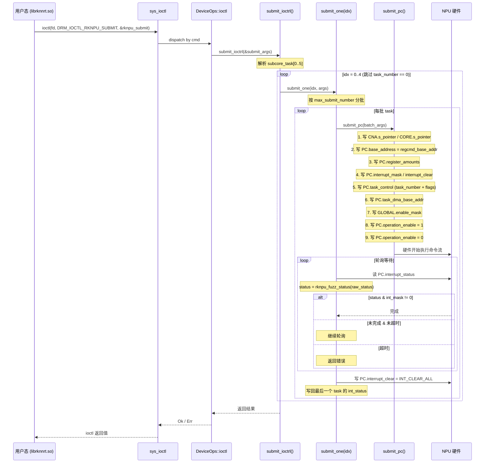
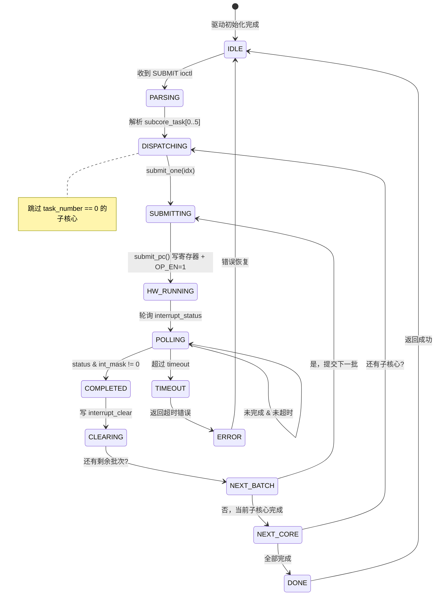

# 模型推理全链条分析

从加载 `.rknn` 模型到推理完成到资源释放的完整逻辑链条。

> 逆向来源：闭源库头文件 `rknn_api.h`、开源内核驱动 `rknpu/`、裸 ioctl demo `npu_benchmark`/`npu_llama`、StarryOS Rust 驱动。

---

## 一、全链条总览

```
┌──────────────────────────────────────────────────────────────────┐
│ 阶段 1：初始化                                                    │
│   rknn_init()                                                    │
│   ├── 打开设备 → 检查硬件版本                                      │
│   ├── 解析 .rknn 模型                                             │
│   ├── 分配 DMA 内存（权重/内部/IO/命令流）                          │
│   ├── 权重转换 → native layout → 拷贝到 DMA 内存                   │
│   └── 编译模型 → 生成命令流 + Task 数组                             │
├──────────────────────────────────────────────────────────────────┤
│ 阶段 2：配置（可选）                                               │
│   rknn_set_core_mask()      → 选择 NPU 核心                      │
│   rknn_register_custom_ops() → 注册自定义算子                      │
│   rknn_set_input_shapes()   → 设置动态 shape                     │
├──────────────────────────────────────────────────────────────────┤
│ 阶段 3：推理循环（可重复执行）                                      │
│   rknn_inputs_set()  → 格式/类型转换 → 拷贝到 DMA → flush cache   │
│   rknn_run()         → 构造 submit → ioctl(SUBMIT) → 等待中断     │
│   rknn_outputs_get() → invalidate cache → 反量化 → 格式转换       │
│   rknn_outputs_release() → 释放输出缓冲                           │
├──────────────────────────────────────────────────────────────────┤
│ 阶段 4：销毁                                                      │
│   rknn_destroy()                                                 │
│   ├── 释放所有 DMA 内存                                           │
│   ├── 关闭设备 fd                                                 │
│   └── 释放上下文                                                  │
└──────────────────────────────────────────────────────────────────┘
```

---

## 二、阶段 1：初始化（`rknn_init`）

### 2.1 设备打开

```
rknn_init()
└── open("/dev/dri/card0") 或 open("/dev/dri/renderD128")
    └── 获取 DRM fd
```

**逆向证据**：`npu_interface.c` 中 `npu_open()` 遍历 `/dev/dri/card*`，用 `drmGetVersion()` 检查驱动名是否为 `"rknpu"`。

### 2.2 硬件版本检查

```c
struct rknpu_action action = { .flags = RKNPU_GET_HW_VERSION };
ioctl(fd, DRM_IOCTL_RKNPU_ACTION, &action);
// action.value → 硬件版本号
```

闭源库据此选择对应的硬件配置（核心数、CBUF 大小、支持的精度等）。

### 2.3 模型解析

`.rknn` 是 Rockchip 私有的模型格式，包含：

| 段 | 内容 | 说明 |
|:---|:-----|:-----|
| 文件头 | 魔数、版本、段表 | 标识文件格式 |
| 网络拓扑 | 层定义、连接关系 | 计算图描述 |
| 权重数据 | 量化后的权重 | 可能已是 native layout |
| 预编译命令流 | 寄存器命令序列 | pre-compile 模型专用 |
| 量化参数 | scale/zp 表 | 每层或每通道 |
| 自定义字符串 | 用户元数据 | 可选 |

**模型格式完全闭源**，无公开文档。

### 2.4 内存分配

闭源库通过 ioctl 分配多块 DMA 内存：

```
ioctl(MEM_CREATE, { size, flags }) → { handle, obj_addr, dma_addr }
ioctl(MEM_MAP, { handle }) → { offset }
mmap(fd, offset) → virt_addr
```

分配的内存块：

| 用途 | flags | 说明 |
|:-----|:------|:-----|
| 权重内存 | `RKNPU_MEM_KERNEL_MAPPING` | 内核态也需要访问 |
| 内部中间缓冲 | 0 或 `RKNPU_MEM_CACHEABLE` | 层间数据传递 |
| 输入缓冲 | 0 | 用户写入输入数据 |
| 输出缓冲 | 0 | 硬件写入输出数据 |
| 命令流缓冲（regcmd） | 0 | 存放 NPUOP 指令序列 |
| Task 数组 | `RKNPU_MEM_KERNEL_MAPPING` | 内核驱动直接读取 |

**逆向证据**：`llama0.c` 中 `build_transformer()` 分配了 regcmd（1024 字节）和 tasks（1024 字节，带 `RKNPU_MEM_KERNEL_MAPPING`）。

### 2.5 权重转换

闭源库将模型权重从存储格式转换为 NPU native layout：

```
原始权重（行主序）
    ↓ 量化（如果需要）
量化权重（INT8/INT4）
    ↓ 重排列
Native Layout（按硬件分块要求）
    ↓ memcpy
DMA 内存
```

**逆向证据**：`llama0.c` 中 `create_weight_cache()` 将 FP32 权重转为 FP16 并用 `feature_data()` 函数重排列到 native layout。

### 2.6 命令流编译

对于非预编译模型，闭源库为每层生成寄存器命令流：

```
网络层描述
    ↓ 参数计算
CNA/CORE/DPU 描述符
    ↓ NPUOP 编码
64-bit 命令序列（regcmd buffer）
    ↓
Task 数组（每个 task 指向一段命令流）
```

每条命令格式：`NPUOP(模块ID, 寄存器值, 寄存器偏移)`

```c
// 编码：[15:0]=寄存器偏移, [47:16]=寄存器值, [63:48]=模块ID
#define NPUOP(op, value, reg) \
    (((uint64_t)(op & 0xffff)) << 48) | \
    (((uint64_t)(value & 0xffffffff)) << 16) | \
    (uint64_t)(reg & 0xffff)
```

**逆向证据**：`npu_matmul.c` 中 `gen_matmul_task()` 生成 108 条 NPUOP 指令，覆盖 CNA（30 条）、CORE（6 条）、DPU（70+ 条）寄存器。

---

## 三、阶段 2：配置

### 3.1 核心选择

```c
rknn_set_core_mask(ctx, RKNN_NPU_CORE_0_1_2);
```

影响后续 `rknn_run()` 中 `rknpu_submit.core_mask` 和 `subcore_task[]` 的填充。

**多核切分逻辑**（闭源库内部）：
- 单核模式：所有 task 在一个核心上顺序执行
- 双核/三核模式：将 task 数组按层切分，分配到不同核心的 `subcore_task[]`

### 3.2 自定义算子注册

```c
rknn_custom_op ops[1] = { ... };
rknn_register_custom_ops(ctx, ops, 1);
```

详见 [自定义算子 API](./custom-op.md)。

---

## 四、阶段 3：推理循环

### 4.1 设置输入（`rknn_inputs_set`）

```c
rknn_input inputs[1];
inputs[0].index = 0;
inputs[0].buf = image_data;
inputs[0].size = 640 * 640 * 3;
inputs[0].type = RKNN_TENSOR_UINT8;
inputs[0].fmt = RKNN_TENSOR_NHWC;
inputs[0].pass_through = 0;

rknn_inputs_set(ctx, 1, inputs);
```

**闭源库内部流程**：

```
用户数据（NHWC, UINT8）
    ↓ pass_through == FALSE
格式转换: NHWC → NC1HWC2（NPU 原生格式）
    ↓
类型转换: UINT8 → INT8（应用 zp 偏移）
    ↓
memcpy → 输入 DMA 缓冲
    ↓
ioctl(MEM_SYNC, SYNC_TO_DEVICE)  // flush CPU cache → 设备可见
```

如果 `pass_through == TRUE`，跳过格式/类型转换，直接拷贝。

### 4.2 执行推理（`rknn_run`）

```c
rknn_run_extend extend = { .non_block = 0, .timeout_ms = 5000 };
rknn_run(ctx, &extend);
```

#### 4.2.1 闭源库侧：构造 `rknpu_submit`

```
rknn_run()
├── 构造 rknpu_submit
│   ├── flags:
│   │   ├── RKNPU_JOB_PC        (1)  ← PC 模式
│   │   ├── RKNPU_JOB_BLOCK     (0)  ← 阻塞（或 NONBLOCK）
│   │   └── RKNPU_JOB_PINGPONG  (4)  ← 乒乓模式
│   ├── timeout = 5000
│   ├── task_start = 0
│   ├── task_number = N（总 task 数）
│   ├── task_obj_addr = tasks DMA 对象地址
│   ├── core_mask = 0x1（单核）或 0x7（三核）
│   └── subcore_task[]:
│       ├── [0] = { start=0, number=N }     ← 核心 0 的 task 范围
│       ├── [1] = { start=N, number=0 }     ← 核心 1（如果启用）
│       └── [2] = { start=N, number=0 }     ← 核心 2（如果启用）
└── ioctl(DRM_IOCTL_RKNPU_SUBMIT, &submit)
```

#### 4.2.2 内核驱动侧：任务提交完整时序



#### 4.2.3 状态机



#### 4.2.4 解析 `subcore_task[5]`

`rknpu_submit` 包含 `subcore_task[5]`，每个元素描述一个子核心要执行的 task 切片：

```
subcore_task[0]: { task_start: 0,  task_number: 10 }  → core 0 执行 task 0~9
subcore_task[1]: { task_start: 10, task_number: 5  }  → core 1 执行 task 10~14
subcore_task[2]: { task_start: 15, task_number: 0  }  → 跳过
subcore_task[3~4]: 跳过
```

驱动遍历 `idx = 0..5`，对 `task_number > 0` 的子核心调用 `submit_one(idx, args)`。

#### 4.2.5 分批提交（`max_submit_number`）

每个子核心的 task 可能很多，但硬件一次能处理的 task 数量有上限（`max_submit_number`，取决于硬件版本）。因此 `submit_one()` 将 task 分批：

```
总 task_number = 100, max_submit_number = 12

批次 1: task[0..12]   → submit_pc()
批次 2: task[12..24]  → submit_pc()
...
批次 9: task[96..100]  → submit_pc()
```

#### 4.2.6 `submit_pc()` 寄存器写入序列

| 步骤 | 寄存器 | 写入值 | 说明 |
|:-----|:-------|:-------|:-----|
| 1 | `CNA.s_pointer` / `CORE.s_pointer` | `0xe + 0x10000000 * core_idx` | 初始化子模块指针 |
| 2 | `PC.base_address` | `regcmd_base_addr` | 命令流 DMA 基址 |
| 3 | `PC.register_amounts` | 计算值 | 命令/寄存器项数量 |
| 4 | `PC.interrupt_mask` | `task.int_mask` | 设置期望的完成中断 |
| 5 | `PC.interrupt_clear` | `task.int_clear` | 清除残留中断 |
| 6 | `PC.task_control` | `((0x6 \| pp_en) << bits) \| task_num` | 任务数量 + 控制位 |
| 7 | `PC.task_dma_base_addr` | task buffer DMA 地址 | task 描述符数组基址 |
| 8 | `GLOBAL.enable_mask` | `task.enable_mask` | 使能相关功能模块 |
| 9 | `PC.operation_enable` | `1` | **触发执行** |
| 10 | `PC.operation_enable` | `0` | 清边沿（脉冲触发） |

> 步骤 9→10 构成一个**上升沿脉冲**，硬件在检测到 OP_EN 从 0→1 时启动命令流执行。

#### 4.2.7 等待完成与中断处理

**Linux 内核驱动**（中断驱动）：

```
rknpu_irq_handler()
├── 读 INT_STATUS 寄存器
├── rknpu_fuzz_status() → 归一化中断状态
├── 写 INT_CLEAR → 清除中断
└── 唤醒 wait_queue / 信号 dma_fence

rknpu_job_done()
├── 写回 task[i].int_status
└── 信号 DMA fence / 唤醒用户态
```

**StarryOS Rust 驱动**（轮询模式）：

```
loop {
    raw_status = read(PC.interrupt_status)
    status = rknpu_fuzz_status(raw_status)

    if status & int_mask != 0 {
        break  // 完成
    }
    if elapsed > timeout {
        return Error::Timeout
    }
    // 继续轮询（yield / sleep）
}
write(PC.interrupt_clear, INT_CLEAR_ALL)  // 0x1ffff
// 写回最后一个 task 的 int_status
```

**`rknpu_fuzz_status()`**：将每个模块的 2-bit 中断组归一化（任一非零 → 全置 1），确保与 `int_mask` 的比较不会因为硬件只置了部分 bit 而误判为未完成。

#### 4.2.8 失败路径

**超时**：

| 触发条件 | 行为 | 恢复 |
|:---------|:-----|:-----|
| 轮询 `interrupt_status` 超过 `submit.timeout` 毫秒 | 返回超时错误 | 写 `interrupt_clear = 0x1ffff`，可能需要 NPU 软复位（`ACTION::ACT_RESET`） |

**异常中断**：

| 触发条件 | 说明 | 检测 |
|:---------|:-----|:-----|
| `DMA_RD_ERR` (bit12) 或 `DMA_WR_ERR` (bit13) | DMA 读写错误（地址非法/IOMMU 映射缺失） | `interrupt_status & 0x3000` |

**非法参数**：

| 参数 | 非法条件 | 行为 |
|:-----|:---------|:-----|
| `task_number` | `== 0`（某个 subcore_task） | 跳过该子核心（非错误） |
| `core_mask` | 无效核心选择 | 返回 `EINVAL` |
| `task_obj_addr` | 无效内核对象地址 | 返回 `EFAULT` |
| `timeout` | `== 0` | 使用默认超时值 |

#### 4.2.9 Linux 内核驱动 vs StarryOS 驱动差异

| 方面 | Linux rknpu 驱动 | StarryOS Rust 驱动 |
|:-----|:-----------------|:-------------------|
| **等待机制** | 中断驱动 + `wait_queue` + `dma_fence` | 轮询 `interrupt_status` |
| **多任务调度** | 内核 job 队列 + 优先级调度 | 串行提交 |
| **fence 支持** | 完整 `dma_fence` + `sync_file` | 未实现 |
| **IOMMU** | RKIOMMU domain attach/detach | 未实现（物理连续内存） |
| **电源管理** | `pm_runtime` + `devfreq` | 直接寄存器操作（最小集） |

### 4.3 获取输出（`rknn_outputs_get`）

```c
rknn_output outputs[3];
memset(outputs, 0, sizeof(outputs));
for (int i = 0; i < 3; i++) {
    outputs[i].index = i;
    outputs[i].want_float = 0;
}
rknn_outputs_get(ctx, 3, outputs, NULL);
```

**闭源库内部流程**：

```
rknn_outputs_get()
│
├── ioctl(MEM_SYNC, SYNC_FROM_DEVICE)  // invalidate cache
│
├── 遍历 outputs[i]:
│   ├── 从输出 DMA 缓冲读取原始数据
│   ├── 如果 want_float:
│   │   ├── 反量化: INT8 → FP32（val = (qval - zp) * scale）
│   │   └── 格式转换: NC1HWC2 → NCHW/NHWC
│   ├── 如果 is_prealloc:
│   │   └── memcpy → 用户提供的 buf
│   └── 否则:
│       ├── malloc(size) → 分配 buf
│       └── memcpy → buf
│
└── 返回
```

### 4.4 释放输出

```c
rknn_outputs_release(ctx, 3, outputs);
```

释放 `rknn_outputs_get` 中 `is_prealloc == FALSE` 时分配的 `buf`。

---

## 五、阶段 4：销毁（`rknn_destroy`）

```c
rknn_destroy(ctx);
```

**内部流程**：

```
rknn_destroy()
├── 释放命令流缓冲
│   └── munmap() + ioctl(MEM_DESTROY)
├── 释放 Task 数组
│   └── munmap() + ioctl(MEM_DESTROY)
├── 释放权重内存
│   └── munmap() + ioctl(MEM_DESTROY)
├── 释放内部中间缓冲
│   └── munmap() + ioctl(MEM_DESTROY)
├── 释放输入/输出缓冲
│   └── munmap() + ioctl(MEM_DESTROY)
├── close(drm_fd)
└── free(context)
```

---

## 六、零拷贝推理路径

使用 `RKNN_FLAG_MEM_ALLOC_OUTSIDE` 时的高级路径：

```c
// 1. 初始化（仅解析模型，不分配 IO 内存）
rknn_init(&ctx, model, size, RKNN_FLAG_MEM_ALLOC_OUTSIDE, NULL);

// 2. 查询内存需求
rknn_mem_size mem_size;
rknn_query(ctx, RKNN_QUERY_MEM_SIZE, &mem_size, sizeof(mem_size));

// 3. 用户分配内存
rknn_tensor_mem* weight_mem = rknn_create_mem(ctx, mem_size.total_weight_size);
rknn_tensor_mem* internal_mem = rknn_create_mem(ctx, mem_size.total_internal_size);

// 4. 绑定内存
rknn_set_weight_mem(ctx, weight_mem);
rknn_set_internal_mem(ctx, internal_mem);

// 5. 查询原生输入/输出属性
rknn_tensor_attr input_attr, output_attr;
input_attr.index = 0;
rknn_query(ctx, RKNN_QUERY_NATIVE_INPUT_ATTR, &input_attr, sizeof(input_attr));

// 6. 分配并绑定 IO 内存
rknn_tensor_mem* input_mem = rknn_create_mem(ctx, input_attr.size_with_stride);
rknn_set_io_mem(ctx, input_mem, &input_attr);

// 7. 直接写入 native layout 数据（无格式转换开销）
memcpy(input_mem->virt_addr, native_data, size);

// 8. 推理
rknn_run(ctx, NULL);

// 9. 直接读取输出（无拷贝）
float* output = (float*)output_mem->virt_addr;
```

此路径避免了 `rknn_inputs_set` 和 `rknn_outputs_get` 中的格式转换和数据拷贝。

---

## 七、异步推理路径

```c
// 初始化时启用异步
rknn_init(&ctx, model, size, RKNN_FLAG_ASYNC_MASK, NULL);

// 帧 0
rknn_inputs_set(ctx, 1, inputs_frame0);
rknn_run(ctx, NULL);
// rknn_outputs_get 返回的是上一帧结果（第一次调用返回空）
rknn_outputs_get(ctx, n, outputs, NULL);

// 帧 1
rknn_inputs_set(ctx, 1, inputs_frame1);
rknn_run(ctx, NULL);
// 返回帧 0 的结果
rknn_outputs_get(ctx, n, outputs, NULL);
```

异步模式下 `rknn_outputs_get` 不等待当前帧完成，直接返回上一帧结果，提高单线程帧率。

---

## 八、DMA Fence 路径

```c
// 初始化时启用 fence
rknn_init(&ctx, model, size,
    RKNN_FLAG_FENCE_IN_OUTSIDE | RKNN_FLAG_FENCE_OUT_OUTSIDE, NULL);

// 推理时传入/获取 fence fd
rknn_run_extend extend;
extend.fence_fd = input_fence_fd;  // 等待输入数据就绪
extend.non_block = 1;
rknn_run(ctx, &extend);

// extend.fence_fd 现在是输出 fence fd
// 可以传给 GPU/RGA 等下游设备
```

对应内核驱动的 `RKNPU_JOB_FENCE_IN` / `RKNPU_JOB_FENCE_OUT` 标志。
