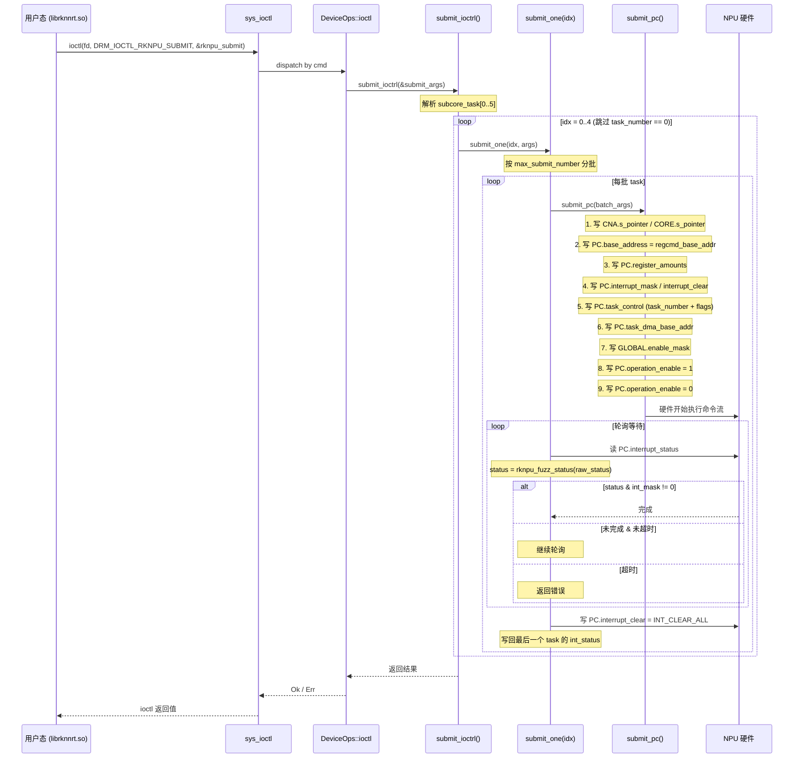
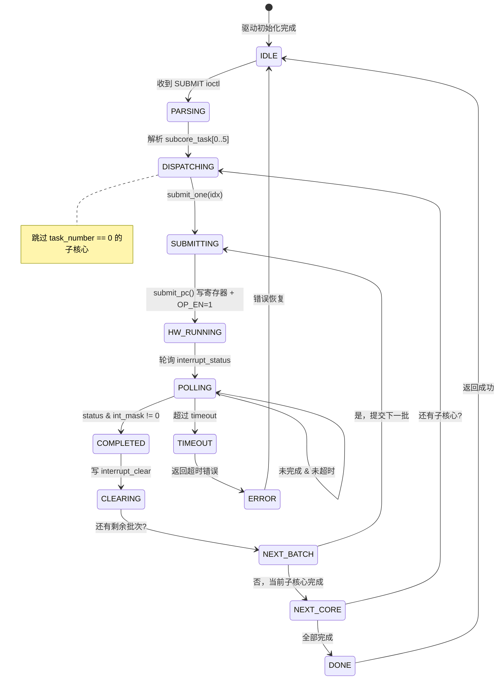
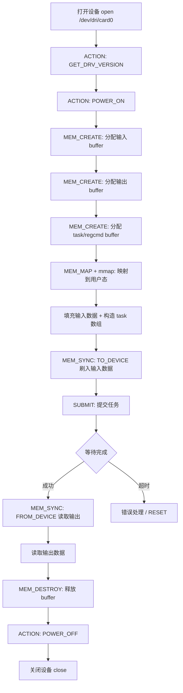

# 任务提交流程

> **本章已合并至 [模型推理全链条 § 4.2](./rknnlibso/lifecycle.md#42-执行推理rknn_run)**，包含完整时序图、状态机、寄存器写入序列、失败路径等全部内容。

以下为旧版内容存档。

---

## 1. 完整时序图（存档）



---

## 2. 状态机



---

## 3. 关键步骤详解

### 3.1 解析 `subcore_task[5]`

`rknpu_submit` 包含 `subcore_task[5]`，每个元素描述一个子核心要执行的 task 切片：

```
subcore_task[0]: { task_start: 0,  task_number: 10 }  → core 0 执行 task 0~9
subcore_task[1]: { task_start: 10, task_number: 5  }  → core 1 执行 task 10~14
subcore_task[2]: { task_start: 15, task_number: 0  }  → 跳过
subcore_task[3]: { task_start: 0,  task_number: 0  }  → 跳过
subcore_task[4]: { task_start: 0,  task_number: 0  }  → 跳过
```

驱动遍历 `idx = 0..5`，对 `task_number > 0` 的子核心调用 `submit_one(idx, args)`。

### 3.2 分批提交（`max_submit_number`）

每个子核心的 task 可能很多，但硬件一次能处理的 task 数量有上限（`max_submit_number`，取决于硬件版本）。因此 `submit_one()` 将 task 分批：

```
总 task_number = 100, max_submit_number = 12

批次 1: task[0..12]   → submit_pc()
批次 2: task[12..24]  → submit_pc()
...
批次 9: task[96..100]  → submit_pc()
```

### 3.3 `submit_pc()` 寄存器写入序列

以下是 `submit_pc()` 的精确寄存器写入顺序：

<table>
<tr><th>步骤</th><th>寄存器</th><th>写入值</th><th>说明</th></tr>
<tr>
<td>1</td>
<td><code>CNA.s_pointer</code><br/><code>CORE.s_pointer</code></td>
<td><code>0xe + 0x10000000 * core_idx</code></td>
<td>初始化子模块指针（仅多核变体）</td>
</tr>
<tr>
<td>2</td>
<td><code>PC.base_address</code></td>
<td><code>regcmd_base_addr</code></td>
<td>命令流 DMA 基址</td>
</tr>
<tr>
<td>3</td>
<td><code>PC.register_amounts</code></td>
<td>计算值</td>
<td>命令/寄存器项数量</td>
</tr>
<tr>
<td>4</td>
<td><code>PC.interrupt_mask</code></td>
<td><code>task.int_mask</code></td>
<td>设置期望的完成中断</td>
</tr>
<tr>
<td>5</td>
<td><code>PC.interrupt_clear</code></td>
<td><code>task.int_clear</code></td>
<td>清除残留中断</td>
</tr>
<tr>
<td>6</td>
<td><code>PC.task_control</code></td>
<td><code>((0x6 | pp_en) &lt;&lt; bits) | task_num</code></td>
<td>任务数量 + 控制位</td>
</tr>
<tr>
<td>7</td>
<td><code>PC.task_dma_base_addr</code></td>
<td>task buffer DMA 地址</td>
<td>task 描述符数组基址</td>
</tr>
<tr>
<td>8</td>
<td><code>GLOBAL.enable_mask</code></td>
<td><code>task.enable_mask</code></td>
<td>使能相关功能模块</td>
</tr>
<tr>
<td>9</td>
<td><code>PC.operation_enable</code></td>
<td><code>1</code></td>
<td><strong>触发执行</strong></td>
</tr>
<tr>
<td>10</td>
<td><code>PC.operation_enable</code></td>
<td><code>0</code></td>
<td>清边沿（脉冲触发）</td>
</tr>
</table>

> 步骤 9→10 构成一个**上升沿脉冲**，硬件在检测到 OP_EN 从 0→1 时启动命令流执行。

### 3.4 等待完成（轮询）

```
loop {
    raw_status = read(PC.interrupt_status)
    status = rknpu_fuzz_status(raw_status)

    if status & int_mask != 0 {
        // 完成
        break
    }
    if elapsed > timeout {
        // 超时
        return Error::Timeout
    }
    // 继续轮询（可能 yield / sleep）
}
```

**`rknpu_fuzz_status()`** 的作用：将每个模块的 2-bit 中断组归一化（任一非零 → 全置 1），确保与 `int_mask` 的比较不会因为硬件只置了部分 bit 而误判为未完成。详见[寄存器地图 §1.3](./register-map.md#13-rknpu_fuzz_status--中断状态归一化)。

### 3.5 清中断与状态写回

完成后：

1. **写 `PC.interrupt_clear = INT_CLEAR_ALL (0x1ffff)`** — 清除所有中断位
2. **写回 `task[last].int_status = status`** — 将实际中断状态写回最后一个 task 的 `int_status` 字段，供用户态读取

---

## 4. 失败路径

### 4.1 超时

<table>
<tr><th>触发条件</th><th>行为</th><th>恢复</th></tr>
<tr>
<td>轮询 <code>interrupt_status</code> 超过 <code>submit.timeout</code> 毫秒</td>
<td>返回超时错误</td>
<td>
<ul>
<li>写 <code>interrupt_clear = INT_CLEAR_ALL</code></li>
<li>可能需要 NPU reset（<code>ACTION::ACT_RESET</code>）</li>
</ul>
</td>
</tr>
</table>

### 4.2 异常中断状态

<table>
<tr><th>触发条件</th><th>说明</th><th>检测方式</th></tr>
<tr>
<td><code>DMA_RD_ERR</code> (bit12) 或 <code>DMA_WR_ERR</code> (bit13) 置位</td>
<td>DMA 读写错误，通常是地址非法或 IOMMU 映射缺失</td>
<td>检查 <code>interrupt_status & 0x3000</code></td>
</tr>
<tr>
<td><code>fuzz_status & int_mask</code> 匹配但包含错误位</td>
<td>部分模块完成但有错误</td>
<td>需要分析各模块的中断位</td>
</tr>
</table>

### 4.3 非法参数

<table>
<tr><th>参数</th><th>非法条件</th><th>行为</th></tr>
<tr>
<td><code>task_number</code></td>
<td><code>== 0</code>（对某个 subcore_task）</td>
<td>跳过该子核心（非错误）</td>
</tr>
<tr>
<td><code>core_mask</code></td>
<td>无效的核心选择</td>
<td>返回 <code>EINVAL</code></td>
</tr>
<tr>
<td><code>task_obj_addr</code></td>
<td>无效的内核对象地址</td>
<td>返回 <code>EFAULT</code></td>
</tr>
<tr>
<td><code>flags</code></td>
<td>包含不支持的 job mode 位</td>
<td>返回 <code>EINVAL</code></td>
</tr>
<tr>
<td><code>timeout</code></td>
<td><code>== 0</code></td>
<td>使用默认超时值</td>
</tr>
</table>

---

## 5. 典型调用链示例

一个完整的 NPU 推理流程（用户态视角）：



---

## 6. 与 Linux rknpu 驱动的差异

<table>
<tr><th>方面</th><th>Linux rknpu 驱动</th><th>StarryOS Rust 驱动</th></tr>
<tr>
<td><strong>等待机制</strong></td>
<td>中断驱动 + <code>wait_queue</code> + <code>dma_fence</code></td>
<td>轮询 <code>interrupt_status</code>（当前实现）</td>
</tr>
<tr>
<td><strong>多任务调度</strong></td>
<td>内核 job 队列 + 优先级调度</td>
<td>串行提交（需外部同步保护）</td>
</tr>
<tr>
<td><strong>fence 支持</strong></td>
<td>完整 <code>dma_fence</code> + <code>sync_file</code></td>
<td>未实现</td>
</tr>
<tr>
<td><strong>IOMMU</strong></td>
<td>RKIOMMU domain attach/detach</td>
<td>未实现（使用物理连续内存）</td>
</tr>
<tr>
<td><strong>电源管理</strong></td>
<td><code>pm_runtime</code> + <code>devfreq</code></td>
<td>直接寄存器操作（最小集）</td>
</tr>
</table>
