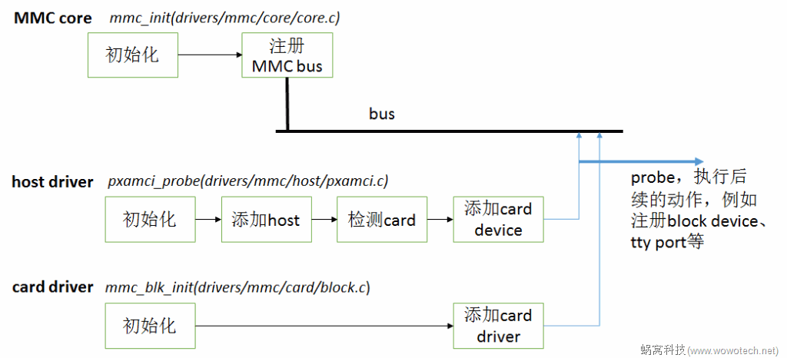

# eMMC

## 设备树信息的解读

RK3568的设备树信息的获取：[https://shimo.im/docs/N2A1gyYZj2Sw9wqD](https://shimo.im/docs/N2A1gyYZj2Sw9wqD)

```
mmc0 = "/sdhci@fe310000";
mmc1 = "/dwmmc@fe2b0000";
mmc2 = "/dwmmc@fe2c0000";
mmc3 = "/dwmmc@fe000000";
```

+ `mmc0 = "/sdhci@fe310000"` - 第一个MMC控制器，使用SDHCI标准接口，位于物理地址`0xfe310000`
+ `mmc1 = "/dwmmc@fe2b0000"` - 第二个MMC控制器，使用DesignWare控制器，位于物理地址`0xfe2b0000`
+ `mmc2 = "/dwmmc@fe2c0000"` - 第三个MMC控制器，也是DesignWare控制器，位于物理地址`0xfe2c0000`
+ `mmc3 = "/dwmmc@fe000000"` - 第四个MMC控制器，同样是DesignWare控制器，位于物理地址`0xfe000000`

### `mmc0`

```
sdhci@fe310000 {
    compatible = "rockchip,rk3568-dwcmshc\0rockchip,dwcmshc-sdhci";
    reg = <0x00 0xfe310000 0x00 0x10000>;
    interrupts = <0x00 0x13 0x04>;
    assigned-clocks = <0x23 0x7b 0x23 0x7d 0x23 0x7c>;
    assigned-clock-rates = <0xbebc200 0x16e3600 0xbebc200>;
    clocks = <0x23 0x7c 0x23 0x7a 0x23 0x79 0x23 0x7b 0x23 0x7d>;
    clock-names = "core\0bus\0axi\0block\0timer";
    resets = <0x23 0x78 0x23 0x76 0x23 0x75 0x23 0x77 0x23 0x79>;
    reset-names = "core\0bus\0axi\0block\0timer";
    status = "okay";
    bus-width = <0x08>;
    no-sdio;
    no-sd;
    non-removable;
    max-frequency = <0xbebc200>;
    full-pwr-cycle-in-suspend;
};
```

+ 基本属性
    + `compatible = "rockchip,rk3568-dwcmshc\0rockchip,dwcmshc-sdhci"` - 兼容性字符串，表明这是RK3568的DesignWare CMSHC控制器，符合SDHCI标准
    + `reg = <0x00 0xfe310000 0x00 0x10000>` - 寄存器地址从`0xfe310000`开始，大小为`64KB`
    + `interrupts = <0x00 0x13 0x04>` - 中断号`19(0x13)`，高电平触发(`0x04`)
    + `status = "okay"` - 控制器已启用

+ 时钟和复位配置
    + `assigned-clocks` 和 `assigned-clock-rates` - 为三个时钟源分配特定频率：
        + 第一个时钟设为200MHz (`0xbebc200`)
        + 第二个时钟设为24MHz (`0x16e3600`)
        + 第三个时钟设为200MHz (`0xbebc200`)
    + `clocks` 和 `clock-names` - 引用五个时钟源：核心时钟、总线时钟、AXI时钟、块时钟和定时器时钟
    + `resets` 和 `reset-names` - 引用五个复位控制器，分别对应五个时钟域

+ eMMC特定配置
    + `bus-width = <0x08>` - 8位数据总线宽度，这是eMMC标准
    + `no-sdio` - 禁用SDIO功能
    + `no-sd` - 禁用SD卡功能
    + `non-removable` - 表示这是不可移除的设备(典型的eMMC闪存)
    + `max-frequency = <0xbebc200>` - 最大频率为200MHz
    + `full-pwr-cycle-in-suspend` - 系统挂起时执行完整的电源循环

### `mmc1`

```
dwmmc@fe2b0000 {
    compatible = "rockchip,rk3568-dw-mshc\0rockchip,rk3288-dw-mshc";
    reg = <0x00 0xfe2b0000 0x00 0x4000>;
    interrupts = <0x00 0x62 0x04>;
    max-frequency = <0x8f0d180>;
    clocks = <0x23 0xb0 0x23 0xb1 0x23 0x18a 0x23 0x18b>;
    clock-names = "biu\0ciu\0ciu-drive\0ciu-sample";
    fifo-depth = <0x100>;
    resets = <0x23 0xd4>;
    reset-names = "reset";
    status = "okay";
    no-sdio;
    no-mmc;
    bus-width = <0x04>;
    cap-mmc-highspeed;
    cap-sd-highspeed;
    disable-wp;
    sd-uhs-sdr104;
    vmmc-supply = <0xcf>;
    vqmmc-supply = <0x31>;
    pinctrl-names = "default";
    pinctrl-0 = <0xd0 0xd1 0xd2 0xd3>;
};
```

+ 基本属性
    + `compatible = "rockchip,rk3568-dw-mshc\0rockchip,rk3288-dw-mshc"` - RK3568兼容的DesignWare MSHC控制器
    + `reg = <0x00 0xfe2b0000 0x00 0x4000>` - 寄存器地址从`0xfe2b0000`开始，大小16KB
    + `interrupts = <0x00 0x62 0x04>` - 中断号`98`，高电平触发
    + `max-frequency = <0x8f0d180>` - 最大频率约150MHz
    + `status = "okay"` - 此控制器已启用

+ SDIO特定配置
    + `no-sdio` - 禁用SDIO功能
    + `no-mmc` - 禁用eMMC功能
    + `bus-width = <0x04>` - 4位数据总线
    + `cap-sd-highspeed` - 支持SD卡高速模式
    + `disable-wp` - 禁用写保护检测
    + `sd-uhs-sdr104` - 支持UHS-I SDR104高速模式
    + `vmmc-supply = <0xcf>` - SD卡电源供应引用
    + `vqmmc-supply = <0x31>` - I/O电压供应引用
    + `pinctrl-0 = <0xd0 0xd1 0xd2 0xd3>` - 引用四组引脚配置（包括数据线、命令线和时钟线）

### `mmc2`

```
dwmmc@fe2c0000 {
    compatible = "rockchip,rk3568-dw-mshc\0rockchip,rk3288-dw-mshc";
    reg = <0x00 0xfe2c0000 0x00 0x4000>;
    interrupts = <0x00 0x63 0x04>;
    max-frequency = <0x8f0d180>;
    clocks = <0x23 0xb2 0x23 0xb3 0x23 0x18c 0x23 0x18d>;
    clock-names = "biu\0ciu\0ciu-drive\0ciu-sample";
    fifo-depth = <0x100>;
    resets = <0x23 0xd6>;
    reset-names = "reset";
    status = "disabled";
};
```

+ 基本属性
    + `compatible = "rockchip,rk3568-dw-mshc\0rockchip,rk3288-dw-mshc"` - 同样是RK3568兼容的控制器
    + `reg = <0x00 0xfe2c0000 0x00 0x4000>` - 寄存器地址从`0xfe2c0000`开始
    + `interrupts = <0x00 0x63 0x04>` - 中断号`99`，高电平触发
    + `max-frequency = <0x8f0d180>` - 最大频率约`150MHz`
    + `status = "disabled"` - 此控制器已禁用

### `mmc3`

```
dwmmc@fe000000 {
    compatible = "rockchip,rk3568-dw-mshc\0rockchip,rk3288-dw-mshc";
    reg = <0x00 0xfe000000 0x00 0x4000>;
    interrupts = <0x00 0x64 0x04>;
    max-frequency = <0x8f0d180>;
    clocks = <0x23 0xc1 0x23 0xc2 0x23 0x18e 0x23 0x18f>;
    clock-names = "biu\0ciu\0ciu-drive\0ciu-sample";
    fifo-depth = <0x100>;
    resets = <0x23 0xeb>;
    reset-names = "reset";
    status = "okay";
    no-sd;
    no-mmc;
    bus-width = <0x04>;
    disable-wp;
    cap-sd-highspeed;
    cap-sdio-irq;
    keep-power-in-suspend;
    pinctrl-names = "default";
    pinctrl-0 = <0xb0 0xb1 0xb2>;
    sd-uhs-sdr104;
    mmc-pwrseq = <0xb3>;
    non-removable;
};
```

+ 基本属性
    + `compatible = "rockchip,rk3568-dw-mshc\0rockchip,rk3288-dw-mshc"` - 兼容性字符串，表明这是Rockchip RK3568的DesignWare MSHC(Mobile Storage Host Controller)
    + `reg = <0x00 0xfe000000 0x00 0x4000>` - 控制器寄存器映射的物理地址范围，起始地址`0xfe000000`，大小为`0x4000(16KB)`
    + `interrupts = <0x00 0x64 0x04>` - 中断配置，中断号`100(0x64)`，触发类型为4(高电平触发)
    + `max-frequency = <0x8f0d180>` - 最大工作频率，约为`150MHz(0x8f0d180 = 150,000,000)`

+ 时钟和复位
    + `clocks = <0x23 0xc1 0x23 0xc2 0x23 0x18e 0x23 0x18f>` - 引用四个时钟源
    + `clock-names = "biu\0ciu\0ciu-drive\0ciu-sample"` - 时钟名称，分别用于总线接口、卡接口、驱动采样和接收采样
    + `resets = <0x23 0xeb>` - 引用复位控制器
    + `reset-names = "reset"` - 复位控制器的名称

+ 控制器配置
    + `fifo-depth = <0x100>` - FIFO深度为256字节
    + `status = "okay"` - 控制器已启用

+ SDIO特定配置
    + `no-sd` - 禁用SD卡支持
    + `no-mmc` - 禁用MMC卡支持(eMMC)
    + `bus-width = <0x04>` - 总线宽度为4位
    + `disable-wp` - 禁用写保护
    + `cap-sd-highspeed` - 支持SD卡高速模式
    + `cap-sdio-irq` - 支持SDIO中断
    + `keep-power-in-suspend` - 系统挂起时保持电源
    + `pinctrl-names = "default"` - 引脚控制配置名称
    + `pinctrl-0 = <0xb0 0xb1 0xb2>` - 引用三组引脚配置
    + `sd-uhs-sdr104` - 支持UHS-I SDR104模式
    + `mmc-pwrseq = <0xb3>` - 引用电源序列控制器
    + `non-removable` - 表示这是不可移除的设备(如板载WiFi模块)

## WSL 连接 USB 设备
通过以管理员模式打开 PowerShell 并输入以下命令，列出所有连接到 Windows 的 USB 设备。 列出设备后，选择并复制要附加到 WSL 的设备总线 ID。

``` powershell
usbipd list
```

在附加 USB 设备之前，必须使用命令 usbipd bind 来共享设备，从而允许它附加到 WSL。 这需要管理员权限。 选择要在 WSL 中使用的设备总线 ID，然后运行以下命令。 运行命令后，请再次使用命令 usbipd list 验证设备是否已共享。

``` PowerShell
usbipd bind --busid 4-4
```

若要附加 USB 设备，请运行以下命令。 （不再需要使用提升的管理员提示。）确保 WSL 命令提示符处于打开状态，以使 WSL 2 轻型 VM 保持活动状态。 请注意，只要 USB 设备连接到 WSL，Windows 将无法使用它。 附加到 WSL 后，任何作为 WSL 2 运行的分发版本都可以使用 USB 设备。 使用 `usbipd list` 验证设备是否已附加。 在 WSL 提示符下，运行 `lsusb` 以验证 USB 设备是否已列出，并且可以使用 Linux 工具与之交互。

``` PowerShell
usbipd attach --wsl --busid <busid>
```
打开 Ubuntu（或首选的 WSL 命令行），使用以下命令列出附加的 USB 设备：

``` Bash
lsusb
```

你应会看到刚刚附加的设备，并且能够使用常规 Linux 工具与之交互。 根据你的应用程序，你可能需要配置 udev 规则以允许非根用户访问设备。

在 WSL 中完成设备使用后，可物理断开 USB 设备，或者从 PowerShell 运行此命令：

``` PowerShell
usbipd detach --busid <busid>
```

## phytium-pci

### MCI

+ `MCIId`: 表示SD/MMC控制器的ID，有两个可能的值：MCI0 和 MCI1。
+ `MCIFifoDepth`: 表示FIFO的深度，定义了不同的深度值（8, 16, 32, 64, 128）。
+ `MCITransMode`: 表示数据传输模式，可以是DMA模式或PIO模式。
+ `MCIIntrType`: 表示中断类型，分为控制器中断和DMA中断。
+ `FsDifEvtType`: 表示事件类型，如卡检测、命令完成、数据传输完成等。
+ `MCIClkSpeed`: 表示时钟速度，定义了不同的时钟频率（400KHz, 25MHz, 26MHz, 50MHz, 52MHz, 66MHz, 100MHz）。
+ `MCICmdData`：表示 SD/MMC 控制器命令的数据结构。它包含了命令的索引、参数、响应、标志、数据以及命令执行的成功状态。
+ `MCIConfig`：配置和管理 SD/MMC 控制器的实例。它包含了控制器实例的 ID、寄存器基地址、中断号、传输模式以及是否为非可移动介质等信息。
+ `MCIData`：用于管理 SD/MMC 控制器数据传输相关的数据。它包含了一个数据缓冲区、DMA 缓冲区地址、块大小、块数量和数据长度等信息。
+ `MCITiming`：用于配置和管理 SD/MMC 控制器的时序参数。它包含了时钟分频、时钟源、相位偏移、是否使用保持模式以及管脚延时等信息。
+ `MCI` 结构体是一个完整的 SD/MMC 控制器驱动模块，包含了初始化、配置、数据传输、中断处理、寄存器操作等功能。

### MCI_Host

+ `MCIHostDevice`：用于描述一个 MCI（MultiMediaCard Interface）主机设备的行为。MCI 是一种用于与多媒体卡（如 SD 卡、MMC 卡等）通信的接口。这个 trait 定义了一系列方法，涵盖了初始化、数据传输、卡检测、时钟设置等操作。


## SD卡驱动的层次结构与实现顺序

SD卡驱动的实现遵循明确的层次结构：
### 1. 控制器初始化（底层）
首先必须初始化SD卡控制器硬件：
```
┌─────────────────────────────────┐
│ 控制器初始化                      │
├─────────────────────────────────┤
│ ➤ 复位SDHCI控制器                │
│ ➤ 配置电源管理                   │
│ ➤ 设置时钟分频器                 │
│ ➤ 配置中断/DMA设置               │
│ ➤ 等待控制器就绪                 │
└─────────────────────────────────┘
```
### 2. SD卡初始化（中间层）
然后使用已初始化的控制器与SD卡通信，执行卡的初始化序列：
```
┌─────────────────────────────────┐
│ SD卡初始化                       │
├─────────────────────────────────┤
│ ➤ CMD0: 复位所有卡               │
│ ➤ CMD8: 发送接口条件             │
│ ➤ CMD55+ACMD41: 初始化卡        │
│ ➤ CMD2: 读取CID                 │
│ ➤ CMD3: 获取相对地址(RCA)        │
│ ➤ CMD9: 读取CSD                 │
│ ➤ CMD7: 选择卡                  │
│ ➤ 配置总线宽度和速度模式          │
└─────────────────────────────────┘
```
### 3. 块级操作（上层）

最后，一旦控制器和卡都初始化好，才能执行实际的数据块读写操作：

单块测试

```
┌─────────────────────────────────┐
│ 块级操作                         │
├─────────────────────────────────┤
│ ➤ read_block()                  │
│   ◦ 设置块大小和传输模式          │
│   ◦ 发送CMD17读取单块命令         │
│   ◦ 等待和接收数据                │
│                                 │
│ ➤ write_block()                 │
│   ◦ 设置块大小和传输模式          │
│   ◦ 发送CMD24写入单块命令         │
│   ◦ 发送数据并等待完成            │
└─────────────────────────────────┘
```

多块

```
┌─────────────────────────────────┐
│ 块级操作                         │
├─────────────────────────────────┤
│ ➤ read_block()                  │
│   ◦ 设置块大小和传输模式          │
│   ◦ 发送CMD{}读取多块命令         │
│   ◦ 等待和接收数据                │
│                                 │
│ ➤ write_block()                 │
│   ◦ 设置块大小和传输模式          │
│   ◦ 发送CMD {} 写多块命令         │
│   ◦ 发送数据并等待完成            │
└─────────────────────────────────┘
``` 

### 依赖关系
这种层次结构的关键点是其中的依赖关系：
+ 没有正常工作的控制器，就无法初始化SD卡
+ 没有正确初始化的SD卡，块操作将会失败
+ 块操作依赖于前两个步骤的成功

## 基于QEMU中的SDHCI-PCI编写SDHCI驱动



参考`Phytium_mci`仓库

## CMD

CMD 信号的协议细节
(1) 命令格式
固定 48 位长度（6字节），结构如下：

| 位 | 47 | 46 | 45:40 | 39:8 | 7:1 | 0 |
| --- | --- | --- | --- | -- | -- | -- |
| 含义 | 起始位（0）| 传输方向（1=Host→Card）| 命令号（如CMD17=17）| 参数（如地址）| CRC7 | 结束位（1）|

(2) 响应格式
类型多样，常见的有：

+ R1（48位）：正常响应，包含卡状态。
+ R2（136位）：CID/CSD寄存器内容。
+ R3（48位）：OCR寄存器内容（如电压支持）。