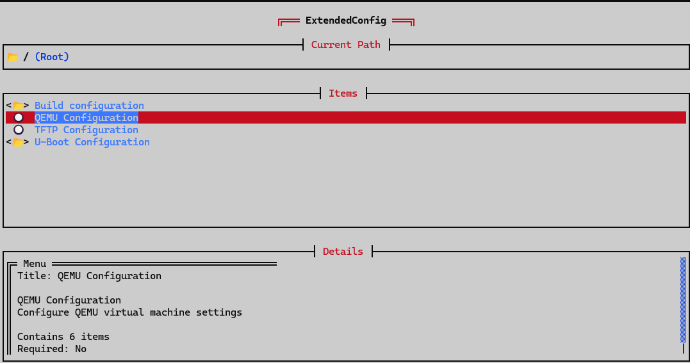

# JKConfig

[](https://crates.io/crates/jkconfig)
[](https://github.com/ZR233/ostool)

A beautiful Terminal User Interface (TUI) configuration editor powered by JSON Schema. JKConfig automatically generates interactive forms from JSON Schema definitions, making configuration management intuitive and error-free.



> **Define your config in Rust → Generate JSON Schema → Edit with beautiful TUI**

```
┌─────────────────┐      ┌──────────────────┐      ┌─────────────────┐
│  Rust Structs   │      │  JSON Schema     │      │   Beautiful     │
│  + schemars     │ ──▶  │  (Auto-gen)      │ ──▶  │   TUI Editor    │
│  (#[derive])    │      │  config.schema   │      │   (jkconfig)    │
└─────────────────┘      └──────────────────┘      └─────────────────┘
         │                                                    │
         │                                                    ▼
         │                                          ┌─────────────────┐
         └──────────────────────────────────────▶  │  Config File    │
                     Load & Use                     │  .toml / .json  │
                                                    └─────────────────┘
```

## ✨ Features

- 🎨 **Beautiful TUI Interface** - Modern, responsive terminal UI built with [Cursive](https://github.com/gyscos/cursive)
- 📋 **JSON Schema Driven** - Automatically generates UI from JSON Schema (Draft 2020-12)
- 🔧 **Multiple Data Types** - Support for String, Integer, Number, Boolean, Enum, Array, Object, and OneOf
- 💾 **Multi-Format Support** - Read/write TOML and JSON configuration files
- ⌨️ **Keyboard Shortcuts** - Efficient navigation with Vim-like keybindings
- 🎯 **Type Validation** - Real-time validation based on schema constraints
- 🔄 **Auto Backup** - Automatic backup before saving changes
- 📚 **Nested Structures** - Handle complex nested objects and arrays
- 🌈 **Color-Coded UI** - Visual indicators for different data types and states

## 🤔 Why JKConfig?

### Traditional Approach
```rust
// ❌ Manual config editing - error prone
// Edit raw TOML/JSON → Easy to make mistakes → Runtime errors
```

### JKConfig Approach
```rust
// ✅ Type-safe from Rust to UI
// Define in Rust → Generate Schema → Edit with TUI → Load with confidence
```

**Benefits:**
- 🛡️ **Type Safety**: Your Rust types define the schema, ensuring consistency
- 🎨 **User Friendly**: Non-developers can edit configs with a beautiful interface
- ⚡ **Fast**: No more hunting through docs to understand config structure
- 🔍 **Discoverable**: Built-in help and descriptions for every field
- 🚀 **Productive**: Keyboard shortcuts for power users

Perfect for:
- 🔧 CLI tools that need user configuration
- 🏗️ Build systems (like ostool!)
- 🎮 Game server configurations
- 🔌 Plugin systems
- 📦 Any Rust project with complex configuration needs

## 📦 Installation

### From Crates.io

```bash
cargo install jkconfig
```

### From Source

```bash
git clone https://github.com/ZR233/ostool.git
cd ostool/jkconfig
cargo build --release
```

## 🚀 Quick Start

The recommended workflow is to define your configuration structure in Rust and generate the JSON Schema automatically.

### 1. Define Your Config Structure in Rust

Add dependencies to your `Cargo.toml`:

```toml
[dependencies]
serde = { version = "1.0", features = ["derive"] }
schemars = { version = "1.0", features = ["derive"] }
```

Create your configuration structure:

```rust
use schemars::{JsonSchema, schema_for};
use serde::{Deserialize, Serialize};

#[derive(Debug, Serialize, Deserialize, JsonSchema)]
struct AppConfig {
    /// Server configuration
    server: ServerConfig,
    /// List of enabled features
    features: Vec<String>,
}

#[derive(Debug, Serialize, Deserialize, JsonSchema)]
struct ServerConfig {
    /// Server hostname or IP address
    host: String,
    /// Server port number
    port: u16,
    /// Enable or disable the server
    #[serde(default)]
    enabled: bool,
}

fn main() {
    // Generate JSON Schema
    let schema = schema_for!(AppConfig);
    let schema_json = serde_json::to_string_pretty(&schema).unwrap();
    
    // Save to file
    std::fs::write("config-schema.json", schema_json).unwrap();
    println!("Schema generated successfully!");
}
```

Run to generate the schema:

```bash
cargo run
# Output: config-schema.json created
```

### 2. (Optional) Create Initial Configuration

Create `config.toml`:

```toml
[server]
host = "localhost"
port = 8080
enabled = true

features = ["logging", "metrics", "auth"]
```

### 3. Launch JKConfig TUI

```bash
# Edit config.toml with the generated schema
jkconfig -c config.toml -s config-schema.json

# Or let it auto-detect (looks for config-schema.json)
jkconfig -c config.toml
```

Now you have a beautiful TUI to edit your configuration! 🎉

### Alternative: Direct JSON Schema

If you prefer writing JSON Schema directly:

<details>
<summary>Click to see JSON Schema example</summary>

Create `config-schema.json`:

```json
{
  "$schema": "https://json-schema.org/draft/2020-12/schema",
  "title": "AppConfig",
  "type": "object",
  "properties": {
    "server": {
      "type": "object",
      "description": "Server configuration",
      "properties": {
        "host": {
          "type": "string",
          "description": "Server hostname or IP address"
        },
        "port": {
          "type": "integer",
          "description": "Server port number"
        },
        "enabled": {
          "type": "boolean",
          "description": "Enable or disable the server"
        }
      },
      "required": ["host", "port"]
    },
    "features": {
      "type": "array",
      "description": "List of enabled features",
      "items": {
        "type": "string"
      }
    }
  },
  "required": ["server", "features"]
}
```

</details>

## 🎮 Usage

### Command Line Options

```bash
jkconfig [OPTIONS]

Options:
  -c, --config <FILE>  Configuration file path [default: .project.toml]
  -s, --schema <FILE>  JSON Schema file path (auto-detected if not specified)
  -h, --help          Print help information
```

### Keyboard Shortcuts

#### Navigation
- `↑`/`↓` or `j`/`k` - Move cursor up/down
- `Enter` - Select/Edit item
- `Esc` - Go back to previous menu

#### Actions
- `C` - Clear current value
- `M` - Toggle menu state (for optional menus)
- `Tab` - Switch OneOf variants

#### Global
- `S` - Save and exit
- `Q` - Quit without saving
- `~` - Toggle debug console

#### Array Editor
- `Enter` - Add new item or edit selected item
- `Del` - Delete selected item
- `Esc` - Close array editor

## 📖 Supported JSON Schema Features

### Data Types

| Type | Description | Example |
|------|-------------|---------|
| `string` | Text input | `"hostname"` |
| `integer` | Whole numbers | `8080` |
| `number` | Decimal numbers | `3.14` |
| `boolean` | True/false toggle | `true` |
| `enum` | Selection list | `["option1", "option2"]` |
| `array` | List of items | `["item1", "item2"]` |
| `object` | Nested structure | `{"key": "value"}` |

### Advanced Features

- **OneOf** - Select one variant from multiple schemas
- **AnyOf** - Flexible variant selection
- **$ref** - Schema references and reuse
- **$defs** - Schema definitions
- **required** - Mark fields as mandatory
- **description** - Display help text
- **default** - Default values

## 🎨 UI Components

### Type Icons

- 📂 Menu/Object
- 🔀 OneOf variant
- 🔡 String
- 🔢 Integer/Number
- ✅/❎ Boolean
- 📚 Enum
- 📋 Array

## 🔧 Configuration File Formats

JKConfig supports both TOML and JSON formats:

### TOML (Recommended)
```toml
[server]
host = "localhost"
port = 8080

features = ["feature1", "feature2"]
```

### JSON
```json
{
  "server": {
    "host": "localhost",
    "port": 8080
  },
  "features": ["feature1", "feature2"]
}
```

## 🛠️ Advanced Usage

### Schema Auto-Detection

If you don't specify a schema file, JKConfig will automatically look for:
- `<config-name>-schema.json`

Example:
- Config: `app.toml` → Schema: `app-schema.json`
- Config: `config.json` → Schema: `config-schema.json`

### Backup System

JKConfig automatically creates backups before saving:
- Format: `bk-<timestamp>.<ext>`
- Example: `bk-1698765432.toml`

### Complex Schemas

JKConfig handles complex nested structures:

```json
{
  "type": "object",
  "properties": {
    "database": {
      "oneOf": [
        {
          "type": "object",
          "properties": {
            "PostgreSQL": {
              "type": "object",
              "properties": {
                "host": { "type": "string" },
                "port": { "type": "integer" }
              }
            }
          }
        },
        {
          "type": "object",
          "properties": {
            "MySQL": {
              "type": "object",
              "properties": {
                "host": { "type": "string" },
                "port": { "type": "integer" }
              }
            }
          }
        }
      ]
    }
  }
}
```

## 🤝 Integration

### Complete Workflow Example

Here's a complete example showing the recommended workflow from Rust structs to TUI editing:

```rust
// config_types.rs
use schemars::{JsonSchema, schema_for};
use serde::{Deserialize, Serialize};

#[derive(Debug, Serialize, Deserialize, JsonSchema)]
pub struct MyAppConfig {
    /// Application name
    pub app_name: String,
    
    /// Server settings
    pub server: ServerConfig,
    
    /// Database configuration
    pub database: DatabaseConfig,
    
    /// Optional features
    #[serde(default)]
    pub features: Vec<String>,
}

#[derive(Debug, Serialize, Deserialize, JsonSchema)]
pub struct ServerConfig {
    pub host: String,
    pub port: u16,
    #[serde(default = "default_true")]
    pub enabled: bool,
}

#[derive(Debug, Serialize, Deserialize, JsonSchema)]
pub struct DatabaseConfig {
    pub url: String,
    pub max_connections: u32,
}

fn default_true() -> bool { true }

fn main() -> anyhow::Result<()> {
    // 1. Generate schema
    let schema = schema_for!(MyAppConfig);
    std::fs::write(
        "myapp-schema.json",
        serde_json::to_string_pretty(&schema)?
    )?;
    
    // 2. Create default config
    let default_config = MyAppConfig {
        app_name: "My Application".to_string(),
        server: ServerConfig {
            host: "0.0.0.0".to_string(),
            port: 8080,
            enabled: true,
        },
        database: DatabaseConfig {
            url: "postgres://localhost/mydb".to_string(),
            max_connections: 10,
        },
        features: vec!["auth".to_string(), "logging".to_string()],
    };
    
    // Save as TOML
    let toml_str = toml::to_string_pretty(&default_config)?;
    std::fs::write("myapp.toml", toml_str)?;
    
    println!("✓ Schema generated: myapp-schema.json");
    println!("✓ Default config created: myapp.toml");
    println!("\nNow run: jkconfig -c myapp.toml");
    
    Ok(())
}
```

### Load Configuration in Your App

```rust
use serde::Deserialize;

#[derive(Deserialize)]
struct MyAppConfig {
    app_name: String,
    server: ServerConfig,
    // ... other fields
}

fn main() -> anyhow::Result<()> {
    // Load the config file (edited with jkconfig)
    let config_str = std::fs::read_to_string("myapp.toml")?;
    let config: MyAppConfig = toml::from_str(&config_str)?;
    
    println!("Starting {} on {}:{}", 
        config.app_name,
        config.server.host,
        config.server.port
    );
    
    // Use your config...
    Ok(())
}
```

### Use JKConfig as a Library

You can also use JKConfig programmatically in your Rust code:

```rust
use jkconfig::data::AppData;

// Load configuration programmatically
let app_data = AppData::new(
    Some("config.toml"),
    Some("config-schema.json")
)?;

// Access the configuration tree
println!("{:#?}", app_data.root);

// Get as JSON for further processing
let json_value = app_data.root.as_json();
```

### Advanced: Complex Enum Types

JKConfig supports complex enum types (OneOf in JSON Schema):

```rust
use schemars::{JsonSchema, schema_for};
use serde::{Deserialize, Serialize};

#[derive(Debug, Serialize, Deserialize, JsonSchema)]
pub enum DatabaseType {
    PostgreSQL {
        host: String,
        port: u16,
        database: String,
    },
    MySQL {
        host: String,
        port: u16,
        database: String,
    },
    SQLite {
        path: String,
    },
}

#[derive(Debug, Serialize, Deserialize, JsonSchema)]
pub struct Config {
    pub database: DatabaseType,
}

fn main() {
    let schema = schema_for!(Config);
    std::fs::write(
        "config-schema.json",
        serde_json::to_string_pretty(&schema).unwrap()
    ).unwrap();
}
```

In the TUI, you can use `Tab` to switch between different database types!

## 📝 Examples

See the `tests/` directory for complete examples:
- Basic object structures
- Enum and OneOf variants
- Nested configurations
- Array handling

## 💡 Best Practices

### 1. Document Your Schema

Use doc comments in your Rust structs - they become descriptions in the UI:

```rust
#[derive(JsonSchema, Serialize, Deserialize)]
struct Config {
    /// The server hostname or IP address.
    /// 
    /// Examples: "localhost", "0.0.0.0", "example.com"
    /// Default: "127.0.0.1"
    host: String,
}
```

### 2. Provide Sensible Defaults

```rust
#[derive(JsonSchema, Serialize, Deserialize)]
struct Config {
    #[serde(default = "default_port")]
    port: u16,
}

fn default_port() -> u16 { 8080 }
```

### 3. Use Enums for Fixed Choices

```rust
#[derive(JsonSchema, Serialize, Deserialize)]
enum LogLevel {
    Error,
    Warn,
    Info,
    Debug,
    Trace,
}
```

### 4. Organize Complex Configs

```rust
// ✅ Good: Organized in modules
#[derive(JsonSchema, Serialize, Deserialize)]
struct AppConfig {
    server: ServerConfig,
    database: DatabaseConfig,
    logging: LoggingConfig,
}

// ❌ Avoid: Flat structure with many fields
struct AppConfig {
    server_host: String,
    server_port: u16,
    db_host: String,
    db_port: u16,
    // ... 50 more fields
}
```

### 5. Version Your Schemas

```rust
#[derive(JsonSchema, Serialize, Deserialize)]
struct Config {
    #[serde(default = "config_version")]
    version: String,
    // ... rest of config
}

fn config_version() -> String { "1.0.0".to_string() }
```

### 6. Integrate into Your Build Process

Add a `build.rs`:

```rust
// build.rs
use schemars::schema_for;

fn main() {
    let schema = schema_for!(MyConfig);
    std::fs::write(
        "config-schema.json",
        serde_json::to_string_pretty(&schema).unwrap()
    ).unwrap();
}
```

### 7. Provide a Config Command

```rust
use clap::Parser;

#[derive(Parser)]
enum Cli {
    /// Run the application
    Run,
    /// Edit configuration with TUI
    Config {
        #[arg(short, long, default_value = "config.toml")]
        file: String,
    },
}

fn main() {
    match Cli::parse() {
        Cli::Run => run_app(),
        Cli::Config { file } => {
            // Launch jkconfig
            std::process::Command::new("jkconfig")
                .arg("-c")
                .arg(&file)
                .status()
                .expect("Failed to launch jkconfig");
        }
    }
}
```

## 🐛 Troubleshooting

### Schema not found
```
Error: Schema file does not exist: config-schema.json
```
**Solution**: Ensure your schema file exists and the path is correct.

### Unsupported file format
```
Error: Unsupported config file extension: "yaml"
```
**Solution**: Use `.toml` or `.json` extensions.

### Invalid schema
```
Error: Schema conversion error at path...
```
**Solution**: Validate your JSON Schema using [JSON Schema Validator](https://www.jsonschemavalidator.net/)

## 🔄 Comparison with Similar Tools

| Feature | JKConfig | Other Config Editors |
|---------|----------|---------------------|
| JSON Schema Support | ✅ Full | ⚠️ Limited |
| Terminal UI | ✅ Modern | ⚠️ Basic |
| Multiple Formats | ✅ TOML/JSON | ⚠️ Varies |
| Type Safety | ✅ Full | ❌ Manual |
| Auto Backup | ✅ Yes | ❌ No |
| Nested Structures | ✅ Full | ⚠️ Limited |

## 📚 Documentation

- [JSON Schema Specification](https://json-schema.org/)
- [Cursive Documentation](https://docs.rs/cursive/)
- [TOML Specification](https://toml.io/)

## 🤝 Contributing

Contributions are welcome! Please feel free to submit a Pull Request.

1. Fork the repository
2. Create your feature branch (`git checkout -b feature/amazing-feature`)
3. Commit your changes (`git commit -m 'Add some amazing feature'`)
4. Push to the branch (`git push origin feature/amazing-feature`)
5. Open a Pull Request

## 📄 License

This project is licensed under either of:

- Apache License, Version 2.0 ([LICENSE-APACHE](LICENSE-APACHE))
- MIT License ([LICENSE-MIT](LICENSE-MIT))

at your option.

## 👏 Acknowledgments

- Built with [Cursive](https://github.com/gyscos/cursive) TUI framework
- Inspired by Linux kernel's `menuconfig`
- JSON Schema validation and parsing

## 📧 Contact

- Author: 周睿 (Zhou Rui)
- Email: zrufo747@outlook.com
- Repository: https://github.com/ZR233/ostool

---

Made with ❤️ by the ostool team
