  
# 基于国产 AI 芯片的 Rust 内核组件开发赛技术报告

## 概述

本项目将采用纯 Rust 编程语言实现的 StarryOS 操作系统移植到了采用国产 RK3588 芯片的 Orange Pi5 Plus 开发板硬件平台上，并实现了完整的外设驱动体系和 AI 推理支持。

在对于 AI 支持方面，我们在实现了对瑞芯微闭源 NPU SDK 中测试 DEMO 的支持的基础上，同时，通过逆向工程实现了在内核态直接操作算子，进而支持自定义深度学习框架，从而最大限度的利用 NPU。

### 硬件规格

我们选择了 Orange Pi5 Plus 开发板作为硬件平台。Orange Pi5 Plus 开发板采用了 Rockchip（瑞芯微电子）最新的 RK3588 作为主控芯片。RK3588 具有八核 64 位（4 × Cortex-A76 + 4 × Cortex-A55）CPU，主频高达 2.4GHz，同时具备了高达 6 TOPS 算力的 NPU。


同时，Orange Pi5 Plus 板载资源丰富，4GB/8GB/16GB 可选的 LPDDR4/LPDDR4x 内存，16M 的 SPI Flash，支持 SD 卡，支持 eMMC 存储，以及其他外设接口。基本满足了面向 ARM PC、边缘计算、个人移动互联网设备以及其他多媒体产品应用

### 主要工作

首先，我们完成了 AArch64 架构的动态平台适配，通过设备树动态获取内存布局，支持任意加载位置启动；实现了 NPU、串口、EMMC 存储、电源时钟等关键驱动，同时基于 VFS 子系统实现了 POSIX 兼容层和 DRM 框架支持，使闭源 AI 库能够在 StarryOS 上正常运行。

| 功能模块     | 组件名称             | 功能描述                                                     |
| ------------ | -------------------- | ------------------------------------------------------------ |
| 平台适配模块 | axplat-aarch64-dyn   | 完成 Orange Pi5 Plus 开发板的硬件适配，支持 StarryOS 在 AArch64 架构上稳定运行 |
| 电源驱动模块 | rockchip-pm          | 控制 RK3588 芯片 NPU 相关电源域，确保硬件正常供电            |
| 时钟驱动模块 | arm-scmi、rk3588-clk | 管理系统时钟和外设时钟，提供精确的时钟控制                   |
| 串口驱动模块 | some-serial          | 提供串口通信支持，用于系统调试和日志输出                     |
| 存储驱动模块 | sdmmc                | 支持 eMMC 存储设备，提供数据读写能力                         |
| NPU 驱动模块 | rknpu                | 控制 RK3588 NPU 硬件，支持 AI 模型推理任务                   |
| 部署工具模块 | ostool               | 简化通过 U-Boot 在 RK3588 上启动 StarryOS 的流程，支持自动编译和部署系统镜像 |

另外，我们开发了 ostool 自动化部署工具简化系统部署流程，并成功运行了 TinyLlama 语言模型和 YOLOv8 目标检测模型，验证了在 NPU 上的 AI 推理能力，性能测试显示 NPU 相比 CPU 在矩阵运算方面有显著加速效果。

## 平台适配

### axplat-aarch64-dyn

由于，StarryOS 所依赖的 ArceOS 原有的 AArch64 平台适配组件 `axplat-aarch64` 采用静态内存布局方式，驱动寄存器基地址也使用硬编码方式定义，进而导致了在不同硬件平台间移植困难。

为此，我们通过 [axplat-aarch64-dyn](axplat-aarch64-dyn) 组件实现了 AArch64 动态平台适配技术。我们创新性地将内存初始化方式从静态配置文件转换为通过设备树动态读取，实现了物理内存地址的动态获取，替代了原有的静态 `const` 定义方式，从而简化移植开发过程。

此外，我们还引入了类似 Linux 的内存分区概念，对不同类型的地址采用不同的映射方式，使其支持 DMA Mask 等特性，使 NPU 驱动可以获得必要的 32 位内存地址。改善后，内核可以在任何支持设备树的 AArch64 平台上运行，并且可以在任意加载位置直接启动，大大提升了系统的移植性和适应性。

### axcpu

原始的 StarryOS 并不支持 AArch64 架构，缺少 `user_entry`, `user_copy` 等关键汇编函数的实现，我们完善了 [axcpu](axcpu) 组件，实现了 AArch64 架构下的用户态进入、异常处理等，并合入了 StarryOS 主项目中，完成了对 AArch64 架构的支持。

### POSIX 兼容层支持

为了支持瑞芯微闭源的 NPU SDK 库中的 `librknnrt.so` 的运行，我们基于 StarryOS 的 VFS 子系统实现了部分 POSIX 兼容层功能。主要包括：

-  系统调用支持：实现了 AI 执行程序所需的 syscall，包括 `rseq` 和 `mknodat` 等关键系统调用，确保闭源库能够正常执行系统级操作。

-  设备控制接口：针对 GPU 和 NPU 设备，实现了相应的 `ioctl` 接口，使应用程序能够通过标准的设备控制方式与硬件进行交互。

-  文件系统接口：扩展了 VFS 子系统，提供了对设备文件（如 `/dev/dri/card0`）的标准访问接口，满足闭源库对 DRM 框架的依赖需求。

## 驱动开发

### 动态驱动框架

为提升 StarryOS 在不同硬件平台间的适配能力，我们基于设备树技术设计并实现了动态驱动框架 rdrive。该框架通过解析设备树信息，能够动态发现与加载硬件驱动，有效解决了传统静态驱动绑定的限制。

rdrive 支持完整的设备树遍历与动态注册机制，并引入依赖注入功能，开发者可通过 `get::<Type>` 方法直接获取已注册的特定类型驱动，从而显著增强系统的灵活性与可扩展性。基于该框架，StarryOS 可更高效地适配多种硬件平台，大幅降低了驱动的开发与维护成本。

### Some-Serial 串口驱动

Orange Pi5 Plus 启动固件默认使用 ns16550a 兼容串口作为主要的调试和日志输出接口。我们通过 [drivers/some-serial](drivers/some-serial) 组件实现了对 RK3588 开发板串口的支持，提供统一的串口接口抽象。

```
src/
├── lib.rs              # 主入口和串口接口抽象
├── pl011.rs            # PL011 串口驱动实现
└── ns16550/            # NS16550 兼容串口驱动实现
tests/
└── test.rs             # 集成测试
```

该驱动支持多种波特率配置，具备中断驱动和轮询模式，满足不同调试需求。通过串口驱动，开发者可以方便地进行系统调试、日志查看和交互操作，提高了开发效率。

### EMMC 驱动

StarryOS 作为完整的操作系统，需要文件系统来管理程序和数据存储。为此，我们在 [drivers/sdmmc](drivers/sdmmc) 组件中实现了针对 RK3588 DWCMSHC 控制器的 eMMC 驱动，支持 eMMC 4.x/5.x 标准，提供了稳定的存储设备访问能力。

```
src/
├── lib.rs              # 主入口和核心功能
├── err.rs              # 错误类型定义
└── emmc/
    ├── mod.rs          # EMMC 模块主文件
    ├── cmd.rs          # 命令发送和响应处理
    ├── block.rs        # 块读写操作
    ├── regs.rs         # 寄存器访问接口
    ├── constant.rs     # 硬件常量定义
    ├── clock.rs        # 时钟控制接口
    ├── rockchip.rs     # Rockchip 平台特定实现
    ├── config.rs       # 平台配置
    ├── aux.rs          # 辅助函数
    └── info.rs         # 卡信息处理
tests/
└── test.rs             # 集成测试，包含 EMMC 功能测试
```

该驱动采用 `no_std` 设计，完全适用于裸机和嵌入式环境，实现了卡识别、初始化、读写等功能，满足 StarryOS 对存储设备的基本需求。通过优化传输模式选择和命令时序管理，提升了数据传输效率和稳定性。

### 电源时钟驱动

电源和时钟驱动的实现确保了 NPU 在运行时能够获得稳定的电源和时钟信号，为 AI 推理任务提供了可靠的硬件基础。Linux 电源域框架和 CLK 框架层级复杂，我们梳理了 RK3588 芯片的电源和时钟架构，针对 NPU 相关的电源域和时钟源进行了详细分析，在数千个寄存器中定位了关键寄存器，并实现了相应的驱动逻辑。

- **rockchip-pm**：实现 RK3588 芯片 NPU 相关电源域的控制，确保硬件正常供电。

    ```
    src/
    ├── lib.rs          # 主入口，对外API
    ├── registers/      # 寄存器定义
    │   └── mod.rs      # 寄存器模块
    └── variants/       # 不同芯片变体支持
        ├── mod.rs      # 变体模块入口
        ├── _macros.rs  # 内部宏定义
        └── rk3588.rs   # RK3588 芯片电源域配置
    tests/
    └── test.rs         # 集成测试
    ```

- **arm-scmi**：实现基于 ARM SCMI 协议的时钟和电源管理，支持通过 SMC 调用与安全监控器通信。

    ```
    src/
    ├── lib.rs              # 主入口和 Scmi 结构体
    ├── protocol/           # SCMI 协议实现
    │   ├── mod.rs          # 通用协议框架和消息传输
    │   └── clock.rs        # 时钟协议实现
    ├── transport/          # 传输层实现
    │   ├── mod.rs          # 传输层 trait 定义
    │   └── smc.rs          # SMC 传输实现
    ├── shmem.rs            # 共享内存管理
    └── err.rs              # 错误处理
    tests/
    └── test.rs             # 集成测试
    ```

- **rk3588-clk**：实现 RK3588 芯片专用的 CRU 控制器时钟管理单元驱动。该组件提供了完整的时钟管理功能，包括 MMC 存储控制器时钟配置、NPU (神经网络处理单元) 时钟管理以及时钟门控等功能。

    ```
    src/
    ├── lib.rs              # 主入口和 Rk3588Cru 结构体定义
    ├── autocs.rs           # 自动时钟选择功能
    ├── clksel.rs           # 时钟选择寄存器定义
    ├── constant.rs         # 硬件常量和时钟 ID 定义
    ├── gate.rs             # 时钟门控寄存器
    ├── pll.rs              # PLL 锁相环控制寄存器
    ├── softrst.rs          # 软件复位寄存器
    └── tools.rs            # 工具函数 (分频计算等)
    tests/
    └── test.rs             # 集成测试，包含 MMC 和 NPU 功能测试
    ```

### NPU 驱动

我们通过 [drivers/rknpu](drivers/rknpu) 组件从零构建了一套 Rust 语言的 RK3588 NPU 驱动系统，提供用户态以及内核态直接操作 NPU 进行计算加速的完整能力。

```
src/
├── lib.rs          # 主入口，对外API
├── osal.rs         # 操作系统抽象层
├── gem.rs          # GEM 内存对象管理
├── ioctrl.rs       # IO 控制接口
├── job.rs          # NPU 任务调度
├── err.rs          # 错误类型定义
├── config/         # 配置管理
│   └── mod.rs      # 配置模块
├── data/           # 数据结构定义
├── registers/      # 寄存器定义
│   ├── mod.rs      # 寄存器模块入口
│   ├── consts.rs   # 寄存器常量
│   ├── global.rs   # 全局寄存器
│   ├── core.rs     # 核心寄存器
│   ├── int.rs      # 中断寄存器
│   ├── pc.rs       # 程序计数器寄存器
│   ├── cna.rs      # CNA 计算单元寄存器
│   ├── ppu.rs      # PPU 像素处理单元寄存器
│   ├── ppu_rdma.rs # PPU RDMA 寄存器
│   ├── dpu.rs      # DPU 数据处理单元寄存器
│   ├── dpu_rdma.rs # DPU RDMA 寄存器
│   ├── sdma.rs     # SDMA 寄存器
│   └── ddma.rs     # DDMA 寄存器
└── task/           # 任务管理
    ├── mod.rs      # 任务模块入口
    ├── def.rs      # 任务定义
    ├── cna.rs      # CNA 任务
    ├── dpu.rs      # DPU 任务
    └── op/         # 操作定义
tests/
└── test.rs         # 集成测试
```

本驱动涵盖了设备初始化、任务提交、中断处理、内存管理等全套核心功能，通过精心设计的 OSAL 抽象层实现了系统依赖的有效隔离。经过数千小时的调试优化，最终实现了与闭源库的高效协同工作，为 AI 推理任务提供了强大的计算加速能力。

#### DRM 框架支持

瑞芯微闭源的 RKNPU 库依赖 Linux DRM 框架提供的设备文件接口，我们基于 StarryOS 的 VFS 子系统实现了部分 DRM 功能，提供了 `/dev/dri/card` 设备文件接口，兼容闭源库对 DRM 的调用需求。

我们梳理了 DRM 框架的核心概念和接口，针对闭源库的调用需求实现了设备信息查询、GEM 内存管理等关键功能，确保闭源库能够正常运行。

#### 难点

瑞芯微官方文档严重不完整，超过 70% 的关键寄存器缺乏明确说明，几乎所有核心配置参数都需要通过 painstaking 的反向工程推导。团队投入了数十小时进行系统性试验：

- 深入分析 Linux 内核 rknpu 驱动的每一行代码，逐个理解寄存器操作逻辑

- 通过二进制分析工具逆向解析闭源库 librknnrt.so 的调用模式

- 结合 RK3588 硬件技术手册和碎片化的社区资料，逐步构建完整的寄存器映射表

- 进行了上百次寄存器配置试验，每次都需要完整重启系统进行验证

RK3588 NPU 集成了 3 个独立的计算核心，Linux 原生驱动采用了复杂的任务调度机制来最大化性能。面对这一挑战，我们：

- 深入研究了 Linux 内核的多核调度算法，理解其核心设计思想

- 基于 Rust 语言的内存安全特性和并发模型，从零设计了一套全新的调度框架

- 重新设计了任务分配策略、负载均衡机制和资源管理方案

NPU 驱动需要与多个子系统协同工作，涉及复杂的内存管理和数据流控制：

- 实现了跨地址空间的内存映射和 DMA 缓冲区管理

- 设计了高效的内存池管理机制，减少内存分配开销

- 处理了中断信号的异步处理和任务状态同步

整个驱动系统完全采用 Rust 语言实现，这在 NPU 驱动开发领域属于首创：

- 需要在保证内存安全的同时，满足底层硬件操作的性能要求

- 解决了 Rust 所有权模型与硬件资源管理的适配问题

- 设计了符合 Rust 语言习惯的异步编程模式，替代传统的 C 风格回调机制

- 实现了零成本抽象，确保 Rust 代码的执行效率不输于 C 语言实现

通过这些技术创新和突破，我们成功构建了一个高性能、高可靠性的 NPU 驱动系统，为 StarryOS 的 AI 计算能力奠定了坚实的技术基础。

## 应用适配

### NPU 性能测试工具

为验证 NPU 驱动的正确性和性能表现，我们基于 [rk3588-npu](https://github.com/mtx512/rk3588-npu) 项目的底层接口，在 `demo/npu_benchmark` 目录下开发了一套性能测试工具。该测试程序可以直接调用我们实现的 NPU 驱动接口，对比 CPU 和 NPU 在矩阵乘法运算中的性能差异。

+ **多精度支持** - 实现 INT8 整数运算和 FP16 半精度浮点运算两种数据类型的矩阵乘法，覆盖不同应用场景
+ **CPU 基准对比** - 每个测试用例都提供纯 CPU 实现作为性能基准，通过计算加速比（Speedup = CPU时间 / NPU时间）量化 NPU 加速效果
+ **多尺寸覆盖** - 测试矩阵规模从小型（1×32×16）到超大型（544×544×4096），全面评估 NPU 在不同负载下的性能表现

测试程序输出详细的性能报告，包括每个配置的执行时间、加速比统计以及通过/失败状态，为 NPU 驱动优化提供量化依据。通过该工具，我们验证了 NPU 在矩阵运算场景下相比 CPU 具有显著的性能优势。

### TinyLlama 语言模型推理

我们基于 [llama2.c](https://github.com/karpathy/llama2.c) 项目提供的轻量级 Transformer 框架的基础上，在 `demo/npu_llama` 目录下针对 RK3588 NPU 进行了适配和优化。我们将原本纯 CPU 的推理代码改造为 NPU 硬件加速版本，具体修改包括以下内容：

+ **混合异构计算架构** - 将 Transformer 中的大规模矩阵运算（QKV 投影、FFN 层等）卸载到 NPU 执行，采用 FP16 精度；对于不满足 NPU 硬件约束的小算子自动回退到 CPU（OpenMP 多线程）
+ **权重预处理优化** - 在模型加载阶段将所有权重矩阵（wq/wk/wv/wo/w1/w2/w3/wcls）批量转换为 NPU 所需的 FP16 格式并缓存在显存中，避免运行时重复的数据类型转换开销
+ **内存池管理机制** - 针对 Transformer 推理中频繁的动态内存分配问题，预分配 8 个不同规模的 NPU 内存池（128KB~2MB），通过内存复用减少分配/释放开销

推理引擎在初始化时输出 NPU 权重缓存成功率和内存池状态等调试信息，运行时根据算子特征自动选择执行路径。通过该测试程序，我们成功在 StarryOS 上部署 TinyLlama Stories 15M 模型并实现文本生成。

### Yolov8 模型

`demo/yolov8` 目录下是修改后的 Yolov8 模型源码。Yolo(You Only Look Once)是一种 one-stage 目标检测算法，即仅需要 “看” 一次就可以识别出图片中物体的 class 类别和边界框。主要用于目标检测、实例分割和图像分类等计算机视觉核心任务。其核心作用是让机器能够快速、准确地“看懂”图像或视频内容。在实际应用中，YOLOv8 可以识别并定位出图像中的特定物体。

本实验中使用模型基于瑞芯微电子（Rockchip）的 rknn_model_zoo开源项目进行开发和修改，主要实现功能有：

- 优化模型使用方式，使用`./rknn_yolov8_demo`可直接运行模型，不再需要其他参数；
- 一次运行可处理多张图片，将检测结果写入`detection_results.txt`文件中便于保存和查看；
- 增加了对`.data`类型文件的尺寸推断功能和图像格式自动设置功能，确保`.data`文件正确识别为RGB888格式，使模型能正确处理`.data`类型文件；
- 添加了图片框图添加脚本`demo/yolov8/tools/visualize.py`,在StarryOS无法直接查看图片情况下，可将`detection_results.txt`文件中内容复制出来，在linux的PC上展示图片识别效果；


## 构建与配置

### OSTool 自动化部署工具

为了简化 StarryOS 在 RK3588 开发板上的部署流程，我们开发了基于 Rust 语言的自动化部署工具 [OSTool](ostool)。该工具实现了与 U-Boot 的无缝对接，支持通过配置文件自动编译和部署系统镜像，避免了手动烧录的繁琐操作。TUI 界面示例如下所示：

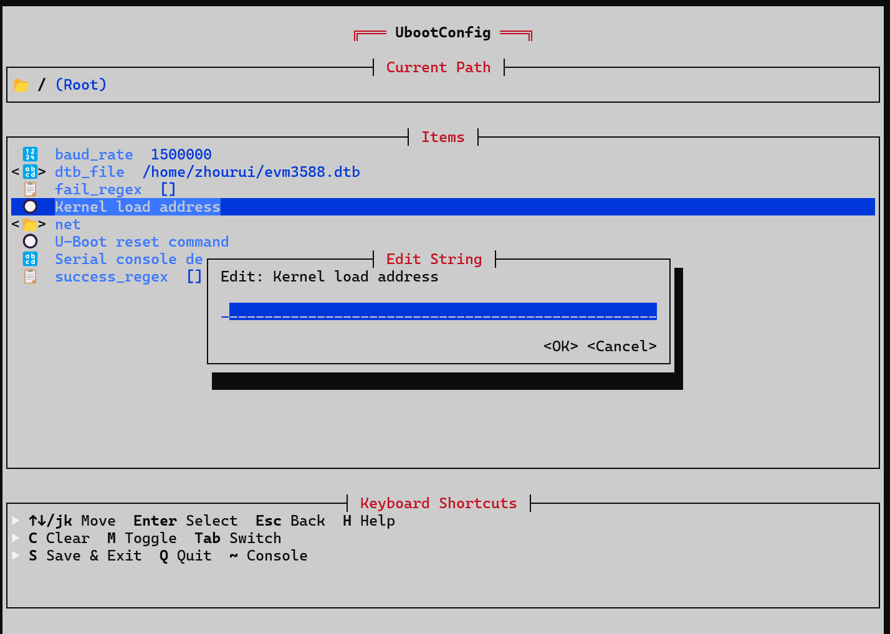

OSTool 支持跨平台运行，可以在 Linux 和 Windows 主机上使用，极大地提高了开发效率。通过集成串口通信功能，OSTool 实现了开发板与主机之间的自动数据传输，简化了调试过程。可以做到一键编译、烧录和启动 StarryOS 系统，并支持TUI图形化配置，极大地提升了开发体验。

### 构建 Starry

为便于构建 StarryOS，我们直接在 Makefile 中新增了构建参数 `aarch64-build`。StarryOS 支持通过 Make 参数配置多种编译选项，用于灵活开启或关闭特定功能。

```bash
# 进入 StarryOS 目录
cd ./StarryOS

# 使用默认配置编译 AArch64 架构版本
make aarch64-build

# 根据需要，开启特定功能
make aarch64-build LOG=info

# 根据需要，关闭特定功能
make aarch64-build LOG=off
```

编译后在 StarryOS 根目下生成 `StarryOS_aarch64-dyn.bin`，该镜像可以直接部署到文件系统中去运行。

### 构建性能测试程序

基准测试工具采用 Meson + Ninja 构建系统进行交叉编译。

```bash
cd ./demo/npu_benchmark

# 清理旧的构建目录（如果存在）
rm -rf benchmark

# 创建构建目录
mkdir benchmark

# 配置构建（交叉编译）
meson setup benchmark --cross-file cross-file.txt

# 或者本地编译（在 RK3588 上）
# meson setup benchmark

# 编译
cd benchmark
ninja
```

编译成功后，可执行文件为 `benchmark/bench_mark`。该文件可直接部署到文件系统中运行

### 构建 LLAMA 模型

Llama 推理引擎同样采用 Meson + Ninja 构建系统进行编译。

```bash
cd ./demo/npu_llama

# 清理旧的构建目录（如果存在）
rm -rf llama

# 创建构建目录
mkdir llama

# 配置构建（交叉编译）
meson setup llama --cross-file cross-file.txt

# 或者本地编译（在 RK3588 上）
# meson setup llama

# 编译
cd llama
ninja
```

编译成功后，可执行文件为 `llama/llama_npu0`。该文件可直接部署到文件系统中运行

### 构建 Yolo v8 模型

- 进入 `cd ./demo/yolov8` 文件夹，执行 `./build-linux.sh -t rk3588 -a aarch64 -d yolov8`

- 生成的模型位于 `demo/yolov8/install/` 目下，我们需要将整个 `install` 目录部署到文件系统中来使用

## 部署及调试

目前，Starry 本身不具备部署条件，我们需要借助于完整 Linux 镜像部署环境来实现部署 Starry 镜像。因此，首先需要基于香橙派官方的 [orangepi-build](https://github.com/orangepi-xunlong/orangepi-build) 构建系统来构建出 Linux 磁盘镜像，然后将 Starry 镜像及应用程序放到 Linux 磁盘镜像中。

当前仓库的 `deploy` 目录下提供了完整的烧写工具和对应的配置文件以及相关镜像文件，可直接用来部署 Starry 系统镜像。不过，由于完整磁盘镜像太大，无法直接放到仓库中，请手动从网盘 https://pan.baidu.com/s/1kWLx3xF8MXz5owP3bIWnfg?pwd=t34q 提取码: t34q 中下载后解压到 `deploy/images` 目录中！

### 启动过程

Orange Pi5 Plus 在上电后会优先执行位于 SPI Flash 中的 `idbloader.img` 和 `u-boot.itb` 程序，`u-boot.itb` 中的 U-Boot 固件进一步读取 eMMC 中的内核镜像并启动内核。

### 烧写 SPI Flash 镜像

[orangepi-build](https://github.com/orangepi-xunlong/orangepi-build) 本身构建后生成的 SPI Flash 镜像并不能使用（SDK 适配有 BUG），这里，我们直接使用 https://github.com/schneid-l/u-boot-orangepi5 中分享的 SPI Flash 镜像

打开 `deploy/RKDevTool_v3.37` 目录下的 `RKDevTool.exe` 右键菜单选择 `导入配置`，然后选择`deploy/config/rk3588_linux_spiflash.cfg` 这个配置文件，选择底部的`强制按地址写` 后点击执行直接将它烧写到 SPI Nor Flash 中即可。

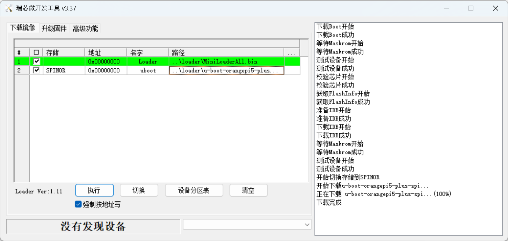

> 烧写前，需要先按住开发板上的 MASKROM 键，然后给开发板上电，使芯片进入 MASKROM 模式

### 烧写 eMMC 镜像

打开 `deploy/RKDevTool_v3.37` 目录下的 `RKDevTool.exe` 右键菜单选择 `导入配置`，然后选择`deploy/config/rk3588_linux_emmc.cfg` 这个配置文件，选择底部的 `强制按地址写` 后点击执行直接将它烧写到 eMMC 中即可。

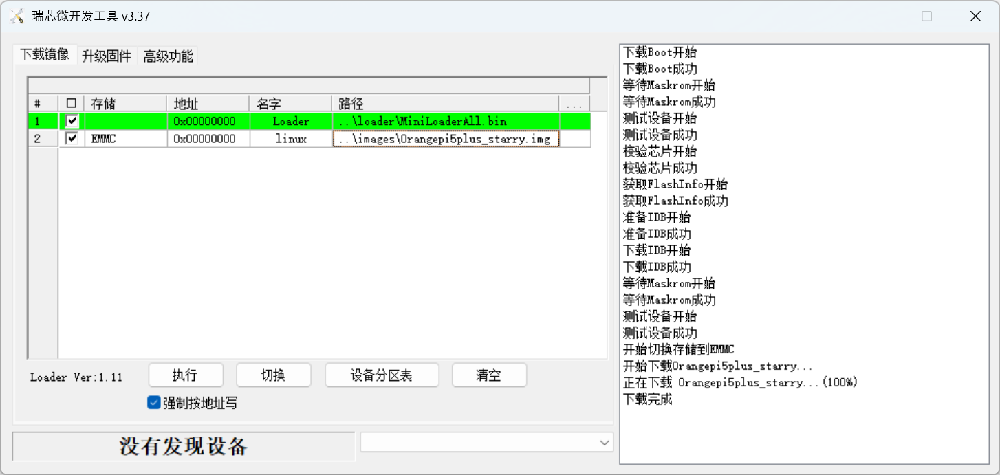

> 烧写前，需要先按住开发板上的 MASKROM 键，然后给开发板上电，使芯片进入 MASKROM 模式

orangepi 磁盘镜像实际上开头是 30M 的空闲区域，紧随其后的是包含了存放内核及 U-Boot 配置文件的 `opt_boot` 分区和 `opi_rootfs` 分区。`opi_boot` 分区中组要就是 U-Boot 配置文件、Linux 内核镜像、内核设备树等这些文件。

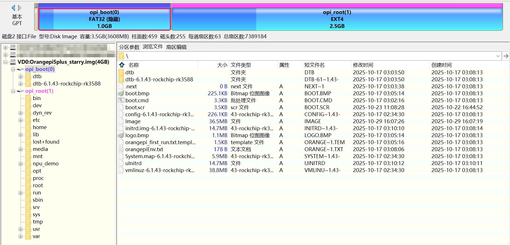

如果需要更新 Starry 镜像，只需要直接将 `starry.bin` 替换 `opi_boot` 分区中的 Image 镜像即可；如果要更新测试应用程序，只需要更新 `opi_rootfs` 分区中的 `npu_demo` 目录下对应的应用程序即可！

### ostool 调试
 
为了便于开发，我们开发了 ostool 调试工具，借助于 ostool 可以方便的在开发板上下载验证 StarryOS 系统镜像，而无需要每次重新烧写完整的磁盘镜像。

#### 安装 ostool 工具
```bash
cd starry-contest
cargo install --force --path ostool/ostool
cargo install jkconfig
```

#### 配置 ostool

**主配置文件**：执行 `jkconfig` 命令，根据提示填写开发板相关配置

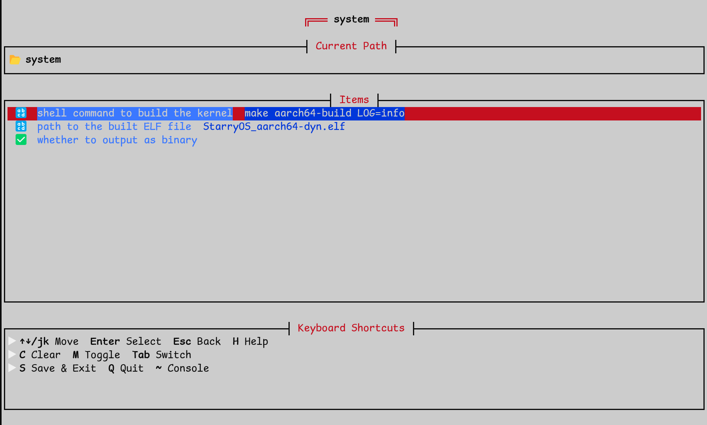

**U-Boot 配置**：执行 `jkconfig -c .uboot.toml` 命令，配置 U-Boot 启动参数，包括设备树地址，串口设备，波特率，网络等等。

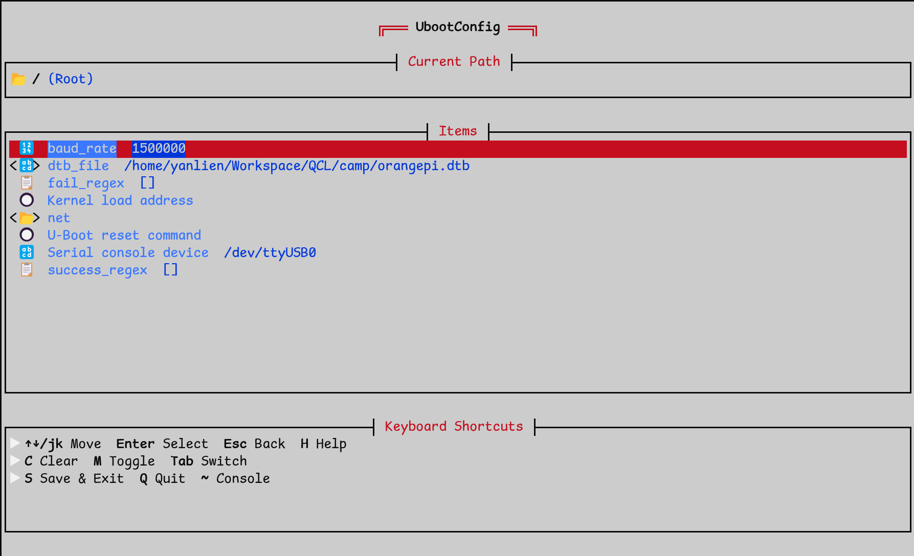

#### 构建并启动 ostool 服务
```bash
ostool run uboot
```

#### 启动 StarryOS

给开发板上电后，ostool 将自动通过网络加载 StarryOS 镜像及相关文件，系统随即启动。

## 测试与验证

部署完相关镜像后，直接上电启动 Orange Pi5 Plus 开发板（或者在源码中执行 `ostool run uboot` 启动）就会自动进入  StarryOS 的 Shell 环境，然后在 Shell 环境中执行应用程序即可。通过启动 LOG 可以看到外设驱动加载正常情况。

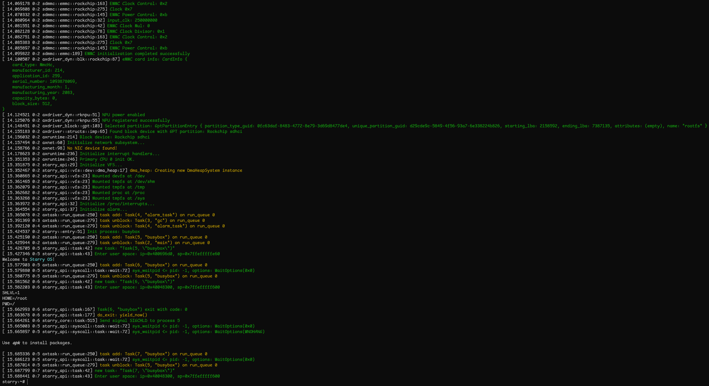

### AI 推理测试

默认的磁盘镜像中已经放置了预编译的 TinyLlama 模型可执行程序 `/demo/llama`，启动后进入 StarryOS 命令行直接执行即可。如果自编译，请按照上文部署的说明放到磁盘中。

- 测试步骤：
	+ 执行 `cd /demo`

	- 运行 `./llama.sh "The sky is blue"`（参数为输入字符串）

- 测试模型：TinyLlama Stories 15M（https://huggingface.co/karpathy/tinyllamas/blob/main/stories15M.bin）

- 测试结果：模型成功在 NPU 上执行推理，并在当前终端中输出连贯文本

	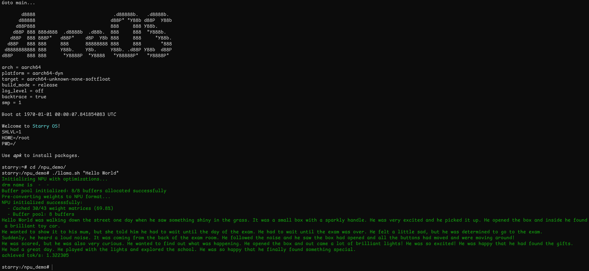

### 性能对比测试

默认的磁盘镜像中已经放置了预编译的性能对比可执行程序 `/demo/benchmark`，启动后进入 StarryOS 命令行直接执行即可。如果自编译，请按照上文部署的说明放到磁盘中。

-  测试步骤：

	- 启动进入 StarryOS 命令行

	- 执行 `cd /demo`

	- 运行 `./benchmark.sh 2`（参数为迭代次数）

- 测试结果：程序直接在当前终端打印出测试结果

	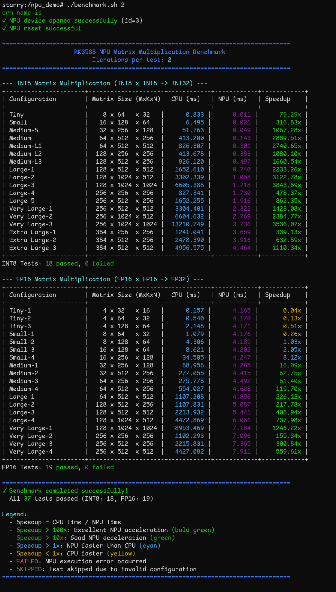

### Yolov8 测试

默认的磁盘镜像中已经放置了预编译的性能对比可执行程序 `/demo/rknn_yolov8/rknn_yolov8_demo`，启动后进入 StarryOS 命令行直接执行即可。如果自编译，请按照上文部署的说明放到磁盘中。

-  测试步骤：

	- 执行 `cd /demo`

	- 运行 `./yolov8.sh`

- 测试结果：程序会将直接输出识别结果，并将结果处理到图片中保存在文件系统中

    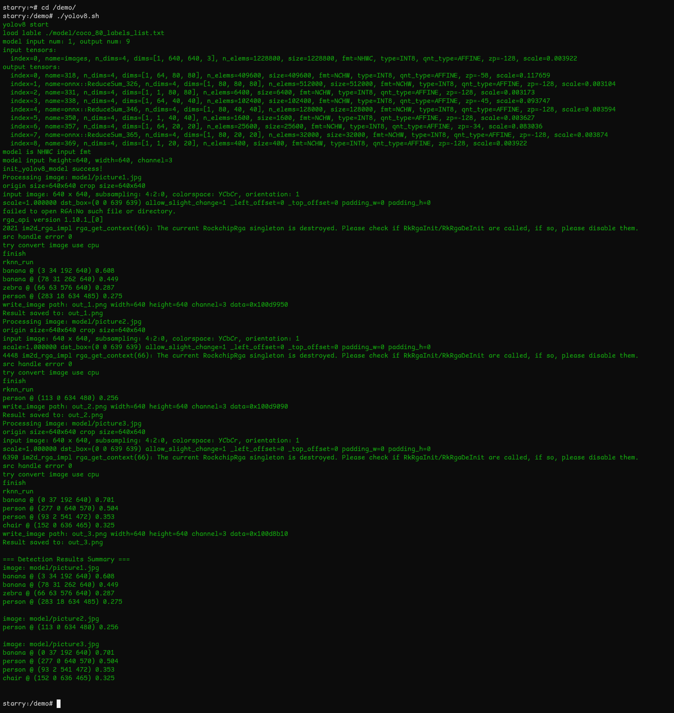

目前，StarryOS 没有可用方法可以直接将其文件系统中的文件导出来，其本身也有没显卡驱动可以直接显示图片。为此，我们提供了两种方法来查看/验证最终的处理结果

- 方法一：模型处理原始图片后会直接在终端中输出识别结果，直接将 `=== Detection Results Summary ===` 和后面内容复并保存到当前仓库的 `demo/yolov8/tools/detection_results.txt` 文件中

    然后在 `demo/yolov8/tools` 下执行 `python3 visualize.py` 手动将识别结果添加到被识别的图片中即可（`rknn_yolov8_demo` 内部本身就是这样实现的）

    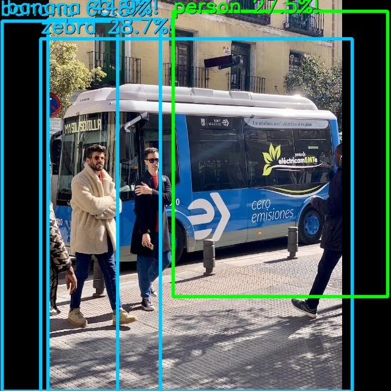
    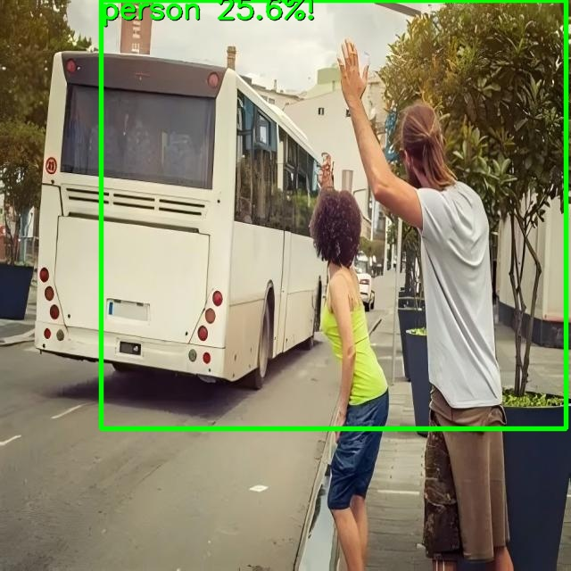
    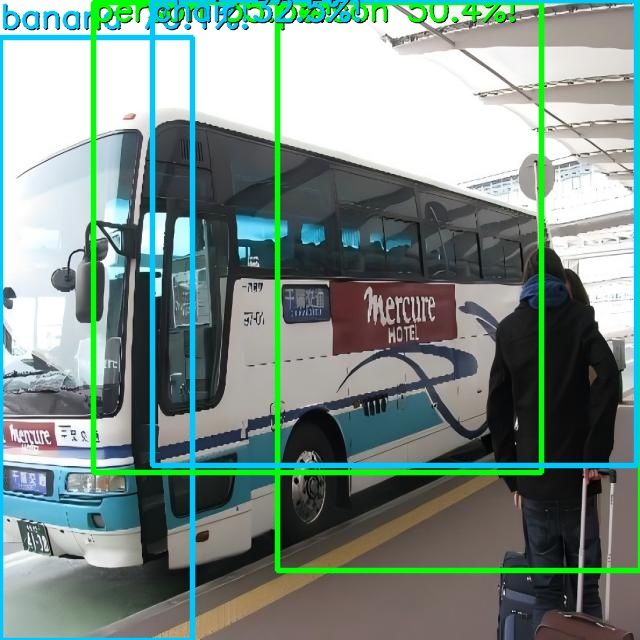

- 方法二：使用 `deploy\RKDevTool_v3.37` 导出开发板上的完整根文件系统，然后直接挂载在 Linux 系统中即可查看原始的图片

    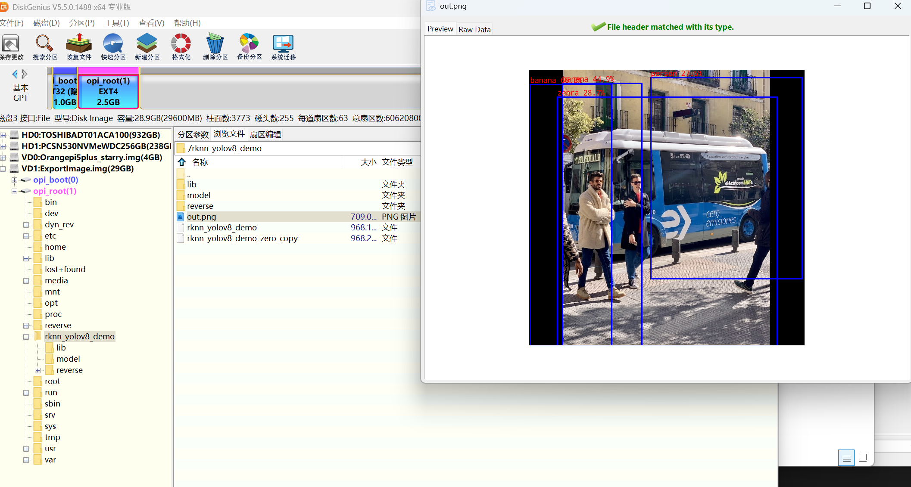

